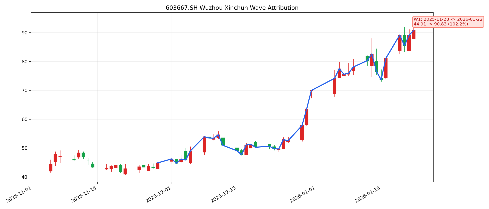

# 五洲新春波段归因

## 基础信息

- 标的名称：五洲新春
- 股票代码：`603667.SH`
- 分析窗口：`2025-11-05` 到 `2026-01-22`
- 案例来源：[stock.xlsx](../../stock.xlsx)
- 一句话逻辑：`机器人消息真空期 + 跨年叙事 + 名字情绪共振`

## 波段列表

- `W1`
  - 波段区间：`2025-11-28` 到 `2026-01-22`
  - 价格区间：`44.91 -> 90.83`
  - 波段涨幅：`102.25%`
  - bars：`38`
  - 是否进入归因分析：`yes`

波段图：



## W1 波段

- 波段区间：`2025-11-28` 到 `2026-01-22`
- 价格区间：`44.91 -> 90.83`
- 波段涨幅：`102.25%`
- 波段审查：
  - 规则切段结论：`主升段`
  - 结合量价与消息节奏的人工作业结论：`up_valid`
- 是否进入归因分析：`yes`

### ChatGPT 联网归因

- 主因：
  `2025-12-29 ~ 2026-01-05｜公开市场信息 / 主题交易叙事｜机器人跨年主线强化｜ChatGPT 先前的联网归因更偏向把这段主升解释为机器人主线在跨年阶段的持续强化，而不是单一公司公告驱动。`
- 备选：
  `2025-11-05 ~ 2025-11-06｜公开活动 / 行业催化｜小鹏科技日发布 IRON、人形机器人主题启动｜更像窗口前段的起涨触发，而不是整段主升的唯一原因。`
- 搜索依据：
  `ChatGPT 在联网搜索里将“五洲新春”更偏向归为机器人主题票，尤其强调 11 月初小鹏科技日与 12 月底跨年机器人主线强化这两条线。`

### 本地 news 库证据

| 序号 | 时间 | 来源 | 标题 | 链接 |
|---|---|---|---|---|
| 1 | 2025-11-05 17:12 | `zsxq_damao` | 小鹏机器人要点 | [link](https://api.zsxq.com/v2/topics/55188244814255154) |
| 2 | 2025-11-05 19:37 | `zsxq_zhuwang` | 【西南机械】小鹏科技日发布全新一代 IRON，预计2026年底量产 | [link](https://api.zsxq.com/v2/topics/45811422181254828) |
| 3 | 2025-11-06 13:03 | `wscn_live` | A股人形机器人概念股午后拉升，五洲新春跟涨 | [link](https://wallstreetcn.com/livenews/3000329) |
| 4 | 2025-11-26 21:58 | `zsxq_damao` | 五洲新春核心逻辑：确定性+大空间 | [link](https://api.zsxq.com/v2/topics/14588521448555552) |
| 5 | 2025-12-05 12:22 | `zsxq_damao` | 【五洲新春】迎接重估 | [link](https://api.zsxq.com/v2/topics/45811881815125228) |
| 6 | 2025-12-17 14:23 | `zsxq_damao` | #五洲新春 重大更新 | [link](https://api.zsxq.com/v2/topics/14588541215281252) |
| 7 | 2025-12-29 13:36 | `wscn_live` | A股机器人概念涨势扩大，五洲新春此前涨停 | [link](https://wallstreetcn.com/livenews/3027920) |
| 8 | 2025-12-30 09:39 | `wscn_live` | A股机器人概念股低开高走，五洲新春直线涨停 | [link](https://wallstreetcn.com/livenews/3028447) |
| 9 | 2025-12-30 14:08 | `zsxq_zhuwang` | 机器人板块回血，开启跨年主线行情 | [link](https://api.zsxq.com/v2/topics/45811814584855588) |

### 证据原文

#### 证据 1
- 时间：`2025-11-05 17:12`
- 来源：`zsxq_damao`
- 标题：小鹏机器人要点
- 链接：[link](https://api.zsxq.com/v2/topics/55188244814255154)
- 原文：
```text
小鹏机器人要点：

iron是第七代，从四足到类人再到更像人。预计明年进入到量产阶段。

- 仿人脊椎，可以实现弯腰触地等类人操作。
- 仿生肌肉，可以定制体型，全包覆柔性皮肤，
- 灵巧手：行业最小谐波减速器（16mm），单手22个自由度，全身82个关节。
- 腰部丝杠
- #行业首发全固态电池，人形机器人是最有可能推动全固态电池量产落地的产品。

大模型：VLT+VLA+VLM高阶大小脑能力组合，小鹏首创大脑的VLT大模型，是机器人自主行动的核心引擎。

应用场景：①打螺丝对灵巧手的损害很大，1个月就要更换，等于国内工人几年的工资。优先进入商业场景提供服务，导寻（导览、导购、导览）是最有可能落地的。
机器人是软件驱动硬件设计的。机器人很有可能是在车规级以上的品质要求。#电池安全>车规，关节设计>车规，感知、域控=车规级别。汽车=集成+创新，机器人=融合+创新。

团队规模：10个团队、20+个合作部门、1000+人的团队规模。#计划在26年底量产高阶人形机器人，目前已经与宝钢确认在导寻方面达成合作。
```

#### 证据 2
- 时间：`2025-11-05 19:37`
- 来源：`zsxq_zhuwang`
- 标题：【西南机械】小鹏科技日发布全新一代 IRON，预计2026年底量产
- 链接：[link](https://api.zsxq.com/v2/topics/45811422181254828)
- 原文：
```text
【西南机械】小鹏科技日发布全新一代 IRON，预计2026年底量产

 极致仿人设计：   仿人脊椎（实现弯腰触地等类人操作）、仿生肌肉（用柔软材料实现体型曲线）、全包覆柔性皮肤（柔软皮肤触感，支持触觉传感）；仿生灵动双肩（肩胛关节四自由度）

 行走拟人化：   增加脚尖被动自由度；脚步轻盈、步伐轻柔、实现猫步行走
头部3D曲面显示：集成“听、说、看、表情”，实现仿生球面设计，配备摄像头、毫米波雷达、惯导等多种传感器

 行业首发应用全固态电池：   极致轻量化，超高能量密度，重量降低30%，电量提升30%；极致安全：250℃高温持续1小时不失控、可抗300G加速度冲击、3mm针刺贯穿不起火；

 灵巧手：   采用行业最小的谐波关节，关节直径10mm，实现单手22个自由度

 大小脑：   搭载3颗图灵 AI芯片，算力达到2250TOPS；大脑（小鹏 VLT 大模型）+交互（小鹏 VLM 大模型）+小脑（小鹏第二代 VLA）

 量产：   小鹏汽车已在广州建立首个具身智能数据工厂，将优先进入商业场景提供服务（导览、导购、导巡），2026年底目标实现规模量产高阶人形机器人

 合作：   IRON将入驻宝钢，在巡检等领域探索应用场景

#关注小鹏机器人供应链：东华测试、汉威科技、双林股份、五洲新春等

西南机械  邰桂龙/周鑫雨/杨云杰
```

#### 证据 3
- 时间：`2025-11-06 13:03`
- 来源：`wscn_live`
- 标题：A股人形机器人概念股午后拉升，五洲新春跟涨
- 链接：[link](https://wallstreetcn.com/livenews/3000329)
- 原文：
```text
A股人形机器人概念股午后拉升，方正电机直线涨停，浙江仙通、五洲新春、绿的谐波、博杰股份、汉宇集团跟涨。
```

#### 证据 4
- 时间：`2025-11-26 21:58`
- 来源：`zsxq_damao`
- 标题：五洲新春核心逻辑：确定性+大空间
- 链接：[link](https://api.zsxq.com/v2/topics/14588521448555552)
- 原文：
```text
五洲新春核心逻辑：确定性+大空间，当前位置看翻倍空间1126

深度绑定XJ：与杭州XJ为背靠背战略合作伙伴，协同研发生产，计划共建海外工厂，XJ目前已经收到多批Gen3手部模组+大丝杠订单。

机器人平台型公司：产品覆盖丝杠、轴承、结构件、执行器等，已形成平台化能力，并深度合作T、ZJ、XP、YS等头部客户。

份额超预期+高ASP：在国内外人形机器人主流厂商中，产品份额显著高于市场预期，单台机器人ASP从2.5W到4W+。
1.T大丝杠+微型丝杠份额预计都在50%以上，Gen3订单近期已经交付。
2.ZJ和XP份额预计是大两位数。
```

#### 证据 5
- 时间：`2025-12-05 12:22`
- 来源：`zsxq_damao`
- 标题：【五洲新春】迎接重估
- 链接：[link](https://api.zsxq.com/v2/topics/45811881815125228)
- 原文：
```text
【五洲新春】迎接重估

1.T链层面：公司与xj深度绑定。近期与舍弗勒合作紧密，零部件份额上升，且会逐步过渡到整体丝杠代工。公司产品从零部件逐步过渡到整体丝杠，单根价值量会有几倍增长。价值量X份额增长双击之下，公司理应重估。

2.公司国内机器人行业统治力强，小鹏、zijie等核心客户均牢牢把控。随着美国推出法案推动机器人行业发展，全球机器人行业有望共振。公司是非T核心标的。

3.综合看，机器人行业beta已到，公司T链+非T链均实锤，且卡位优势明显，看好未来发展。
    
 招商中小盘
```

#### 证据 6
- 时间：`2025-12-17 14:23`
- 来源：`zsxq_damao`
- 标题：#五洲新春 重大更新
- 链接：[link](https://api.zsxq.com/v2/topics/14588541215281252)
- 原文：
```text
<e type="hashtag" hid="28844852481581" title="%23%E4%BA%94%E6%B4%B2%E6%96%B0%E6%98%A5%23" /> 重大更新

1. 与尼得科深度合作：a.供应旋转关节轴承，预期单套几百价值量，全身14套；b.手部微型丝杠代工，尼得科贴牌，五洲生产。
2. 与小鹏深度合作：已经交多款身体丝杠，手部依托xj，小鹏丝杠通吃。

整体看，公司t链核心tier1全覆盖，t链丝杠全覆盖，新增t链旋转关节轴承，国内客户卡位一流，看好未来发展！

风险提示：机器人进度低于预期

招商中小盘
```

#### 证据 7
- 时间：`2025-12-29 13:36`
- 来源：`wscn_live`
- 标题：A股机器人概念涨势扩大，五洲新春此前涨停
- 链接：[link](https://wallstreetcn.com/livenews/3027920)
- 原文：
```text
A股机器人概念涨势扩大，上纬新材、步科股份20cm涨停，双双创历史新高，天奇股份、五洲新春、征和工业等多股此前涨停，斯菱智驱、大鹏工业涨超10%。
```

#### 证据 8
- 时间：`2025-12-30 09:39`
- 来源：`wscn_live`
- 标题：A股机器人概念股低开高走，五洲新春直线涨停
- 链接：[link](https://wallstreetcn.com/livenews/3028447)
- 原文：
```text
A股机器人概念股低开高走，锋龙股份5连板，五洲新春直线涨停，龙洲股份、步科股份、昊志机电、景业智能等跟涨。
```

#### 证据 9
- 时间：`2025-12-30 14:08`
- 来源：`zsxq_zhuwang`
- 标题：机器人板块回血，开启跨年主线行情
- 链接：[link](https://api.zsxq.com/v2/topics/45811814584855588)
- 原文：
```text
🧧机器人板块回血，开启跨年主线行情【中泰电新】

今日机器人板块大涨，主要为T的新一轮审厂开始，部分公司陆续接到新的图纸等因素催化。一方面T茶V3定型在即，有送样-发包-审厂-定点-图纸更新等密集催化，供应链体系趋于收敛；另一方面国内企业加紧资本市场融资及上市动作，春节期间人形机器人具有更多的电视展示平台，有望启动新一轮的跨年行情。

重点关注：
1）T链-拓普集团、三花智控、浙江荣泰、均胜电子，伟创电气等；
2）XJ链-五洲新春、金沃股份等；
3）电子皮肤-汉威科技等；
4）电机-恒帅股份、步科股份等；
5）研发推进-震裕科技、科达利等。

风险提示：量产布局预期等。
```
### 量价与概念验证

- 个股窗口涨幅：`105.08%`
- top5 候选概念：

| 概念 | 代码 | 区间涨幅 | 收盘价相关系数 | 日收益率相关系数 |
|---|---|---:|---:|---:|
| 人形机器人 | `886069.TI` | `11.5274%` | `0.9439` | `0.4718` |
| 特斯拉概念 | `885467.TI` | `13.6919%` | `0.9372` | `0.3996` |
| 减速器 | `886008.TI` | `9.9665%` | `0.9281` | `0.5313` |
| 机器人概念 | `885517.TI` | `10.5118%` | `0.9250` | `0.3351` |
| 新能源汽车 | `885431.TI` | `11.1036%` | `0.9189` | `0.3386` |
- 量价结论：
  `五洲新春与机器人主线，尤其是人形机器人、特斯拉概念和减速器方向的同步性都很高，但个股涨幅显著高于概念指数，说明它不是纯独立逻辑，更像板块主线中的高弹性强势股。`

### 综合裁决

- 主因：
  `2025-12-29 起｜机器人跨年主线强化｜跨年阶段板块抱团、情绪升温和主题交易共振，五洲新春作为高弹性机器人链个股进入加速主升。`
- 备选：
  `2025-11-05 ~ 2025-11-06｜小鹏科技日 / IRON 发布｜人形机器人主题催化打开窗口前段的起涨预期，是更早的启动触发点。`
- 最终判定：
  `机器人主线 + 跨年情绪 + 个股高弹性共振`
- 结论说明：
  `这段行情不是公司单独公告驱动。更合理的解释是：11 月初小鹏科技日和 IRON 机器人给了主题启动信号，12 月底到 1 月上旬机器人跨年主线强化，五洲新春在板块内被资金做成高弹性强势股。`
- 置信度：
  `中高`

## 备注

- 本次报告使用了 `event_quant` 与 `event_news` 的本地 PostgreSQL 数据
- 五洲新春这次同时也是 `stock-wave-attribution` skill 的验证样本之一
