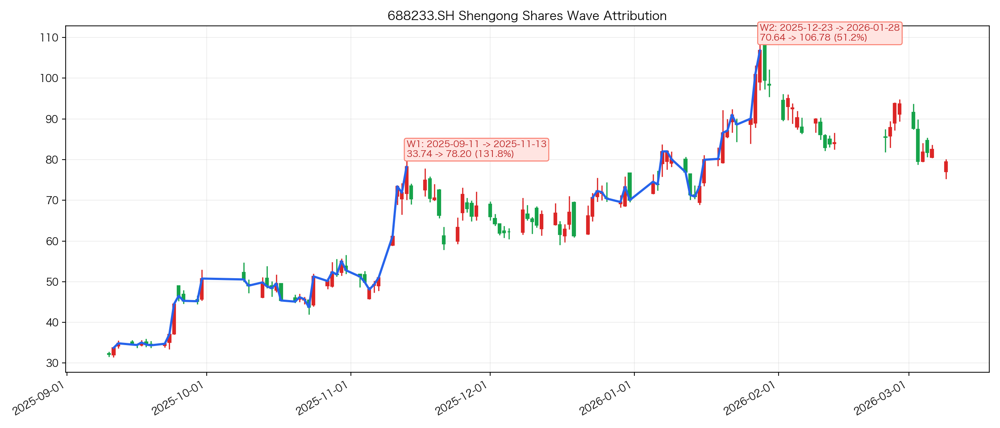

# 神工股份波段归因

## 基础信息

- 标的名称：神工股份
- 股票代码：`688233.SH`
- 分析窗口：`2025-09-10` 到 `2026-03-09`
- 来源池：[universe-wencai-top200](../../data/wencai_top200_20250910_20260309.csv)
- 核心方向：`半导体材料/硅零部件/存储扩产链`

## 波段列表

- `W1`
  - 波段区间：`2025-09-11` 到 `2025-11-13`
  - 价格区间：`33.74 -> 78.20`
  - 波段涨幅：`131.77%`
  - bars：`40`
  - 是否进入归因分析：`yes`
- `W2`
  - 波段区间：`2025-12-23` 到 `2026-01-28`
  - 价格区间：`70.64 -> 106.78`
  - 波段涨幅：`51.16%`
  - bars：`25`
  - 是否进入归因分析：`yes`

波段图：



## W1 波段

- 波段区间：`2025-09-11` 到 `2025-11-13`
- 价格区间：`33.74 -> 78.20`
- 波段涨幅：`131.77%`
- 波段审查：
  - 规则切段结论：`主升段`
  - 本轮作业结论：`up_valid`
- 是否进入归因分析：`yes`

### ChatGPT 联网归因

- 主因：
  `2025-10-25 三季报 + 2025-10-26 投资者关系活动记录把逻辑坐实，公司披露前三季度营收同比增长 47.59%、归母净利同比增长 158.93%，并明确硅零部件受益于本土存储厂开工率提升与国产替代深化，因此这段上涨更像“业绩验证后的存储链上游耗材重估”。`
- 备选：
  `2025-11-09 闪迪上调 NAND 合约价 50%，带动 A 股存储链情绪在 11 月上旬集中扩散，而 2025-11-12 公司异动公告又明确无未披露重大事项，说明末段加速更偏板块/产业链驱动。`
- 搜索依据：
  `2025-09-26 投资者关系活动记录表明确硅零部件终端用于存储芯片制造厂刻蚀工艺，并强调中国芯片制造国产化进入深水区；2025-10-25 三季报披露前三季度营收同比 +47.59%，增长来自大直径硅材料订单扩大和硅零部件重点客户出货提升；2025-10-26 投资者关系活动记录再次强调本土存储厂发展迅猛、若开工率提升需求将向公司传导；2025-11-09 媒体报道闪迪 11 月大幅上调 NAND 合约价；2025-11-12 公司异动公告说明无重大事项、仅重述 10 月经营数据。`

### 本地 news 库证据

| 序号 | 时间 | 来源 | 标题 | 链接 |
|---|---|---|---|---|
| 1 | 2025-09-12 07:37 | `zsxq_zhuwang` | 【华安电子】国产存储双雄崛起，存储国产化持续推进 | [link](https://api.zsxq.com/v2/topics/1521254142221252) |
| 2 | 2025-09-18 06:10 | `zsxq_zhuwang` | 【国信电子｜半导体设备材料持续推荐】先进逻辑与存储国产线持续突破，看好半导体设备材料自主可控链 | [link](https://api.zsxq.com/v2/topics/1521258482151242) |
| 3 | 2025-09-23 12:27 | `zsxq_zhuwang` | 【华安电子】国产存储双雄崛起，存储国产化持续推进 | [link](https://api.zsxq.com/v2/topics/5124258242158124) |
| 4 | 2025-09-24 02:53 | `zsxq_zhuwang` | 【华安电子】长鑫存储启动上市辅导，国产存储双雄值得重视 | [link](https://api.zsxq.com/v2/topics/4842451541548188) |
| 5 | 2025-09-24 04:06 | `zsxq_damao` | 半导体材料：首日大涨，原因为何？能否持续？ | [link](https://api.zsxq.com/v2/topics/4842451585852288) |
| 6 | 2025-09-24 10:14 | `zsxq_zhuwang` | 半导体设备持续推荐：2026年先进逻辑扩产可观，两存扩产预期加速，关注上游自主可控产业链！ | [link](https://api.zsxq.com/v2/topics/5124258542418454) |
| 7 | 2025-11-09 02:07 | `zsxq_zhuwang` | 【浙商电子团队重大推荐】神工股份 | [link](https://api.zsxq.com/v2/topics/1521282424284152) |
| 8 | 2025-11-11 02:11 | `zsxq_damao` | 【浙商电子 高宇洋】近期重点推荐 | [link](https://api.zsxq.com/v2/topics/2854212458514481) |

### 证据原文

#### 证据 1
- 时间：`2025-09-12 07:37`
- 来源：`zsxq_zhuwang`
- 标题：【华安电子】国产存储双雄崛起，存储国产化持续推进
- 链接：[link](https://api.zsxq.com/v2/topics/1521254142221252)
- 原文：
```text
【华安电子】国产存储双雄崛起，存储国产化持续推进
[太阳]国产存储产业链相关设备/零部件/材料公司包括：
【1】精智达技术（688627）（公司半导体收入股权激励目标25年相比24年公司半导体收入翻倍增长，主力配套合肥长鑫，1季度已落实FT测试机正式订单和产品技术验证）。
【2】神工股份（688233）（硅零部件产品已经进入长江存储、北方华创等中国领先的本土存储类集成电路制造厂商和国产半导体设备厂商），终端存储业务占比收入比重高，未来或进入其他国产存储厂配套。
```

#### 证据 2
- 时间：`2025-09-18 06:10`
- 来源：`zsxq_zhuwang`
- 标题：【国信电子｜半导体设备材料持续推荐】先进逻辑与存储国产线持续突破，看好半导体设备材料自主可控链
- 链接：[link](https://api.zsxq.com/v2/topics/1521258482151242)
- 原文：
```text
【国信电子｜半导体设备材料持续推荐】先进逻辑与存储国产线持续突破，看好半导体设备材料自主可控链

[玫瑰]先进逻辑关键设备进入规模化量产，国产先进制程扩产有望超预期。受海外半导体制裁影响，国内先进制程产线有望超预期扩产。同时，伴随下半年国内先进逻辑及存储晶圆厂逐步开启新一轮招标，有望带动半导体设备公司订单增长。根据中微公司与拓荆科技的中报预告，设备公司同环比增长显著，在先进设备方面，中微多种关键刻蚀工艺实现大规模量产，高端产品新增付运量显著提升；拓荆先进制程的验证机台已顺利通过客户认证，逐步进入规模化量产阶段。

[玫瑰]BIS计划取消外资晶圆厂豁免，半导体零部件材料有望打开新市场空间。根据《<e type="web" href="https%3A%2F%2Fwx.zsxq.com%2Fmweb%2Fviews%2Fweread%2Fsearch.html%3Fkeyword%3D%E5%8D%8E%E5%B0%94%E8%A1%97%E6%97%A5%E6%8A%A5" title="%E5%8D%8E%E5%B0%94%E8%A1%97%E6%97%A5%E6%8A%A5" style="book" />》6月报道，BIS计划取消三星电子、SK海力士、台积电等在中国大陆拥有晶圆厂的晶圆制造商在中国使用美国技术的豁免。若豁免政策取消，西安三星、无锡海力士、台积电南京等晶圆厂将提升半导体设备、材料、零部件的国内供应链比例，国产零部件与材料公司有望打开新市场空间。

【半导体设备】北方华创、中微公司、拓荆科技、芯源微、华海清科、长川科技、精测电子、中科飞测等
【材料&零部件】江丰电子、鼎龙股份、神工股份等
【光刻机零部件】茂莱光学、波长光电、福晶科技、永新光学等
```

#### 证据 3
- 时间：`2025-09-23 12:27`
- 来源：`zsxq_zhuwang`
- 标题：【华安电子】国产存储双雄崛起，存储国产化持续推进
- 链接：[link](https://api.zsxq.com/v2/topics/5124258242158124)
- 原文：
```text
【华安电子】国产存储双雄崛起，存储国产化持续推进

[太阳] 国产存储产业链相关设备/零部件/材料公司包括：

【1】精智达技术（688627）（公司半导体收入股权激励目标25年相比24年公司半导体收入翻倍增长，主力配套合肥长鑫，1季度已落实FT测试机正式订单和产品技术验证）。

【2】神工股份（688233）（硅零部件产品已经进入长江存储、北方华创等中国领先的本土存储类集成电路制造厂商和国产半导体设备厂商），终端存储业务占比收入比重高，未来或进入其他国产存储厂配套。
```

#### 证据 4
- 时间：`2025-09-24 02:53`
- 来源：`zsxq_zhuwang`
- 标题：【华安电子】长鑫存储启动上市辅导，国产存储双雄值得重视
- 链接：[link](https://api.zsxq.com/v2/topics/4842451541548188)
- 原文：
```text
【华安电子】长鑫存储启动上市辅导，国产存储双雄值得重视 

🇨🇳『科技自立自强是国家安全之要，存储芯片安全是信息安全的核心』
[太阳]2025年Q1，中国长鑫存储（CXMT）与长江存储（YMTC）季度营收均突破10亿美元大关。这一里程碑式的成就，标志着国内存储企业在全球舞台上正逐步崭露头角，打破了长期以来由国际巨头主导的市场格局。

🇨🇳 长鑫存储与长江存储的崛起，带动了整个产业的技术升级与发展。同时也有助于提升我国在全球半导体产业链中的地位，降低对进口存储芯片的依赖，保障国家信息安全。

[太阳] 『国产存储双雄崛起，存储芯片国产化持续进行』

[福] 市占率方面，Counterpoint预测称，到2025年末，长鑫的按比特出货量计市占将从一季度的6%提升到8%。在技术迭代方面，长鑫存储今年的产能将从DDR4/LPDDR4加速向DDR5/LPDDR5过渡，反映到出货量上就是DDR5/LPDDR5的市场份额将从一季度的1%左右分别提升到7%和9%。

[红包] 技术创新方面，长鑫存储成功量产本土DDR5模组，长鑫存储正寻求追赶HBM，长鑫2024年下半已开始量产HBM2，长鑫正研发HBM3并计划最快2026年量产；目标是在2027年宣布HBM3E，并推动量产，颇具雄心壮志。

[太阳] 长江存储已成功实现294层3D NAND量产，并积极推进300层NAND开发，层数已逼近三星，其采用自研Xtacking4.0与先进CMOS Bonded Array（CBA）架构，同时导入PLC技术提升密度。

[太阳] 长鑫存储与长江存储正持续扩建先进制程产线，未来12至24个月内，是观察中国存储是否进一步跃升为全球存储强权的关键指标。

[太阳] 国产存储产业链相关设备/零部件/材料公司包括：

【1】精智达技术（688627）（公司半导体收入股权激励目标25年相比24年公司半导体收入翻倍增长，主力配套合肥长鑫，1季度已落实FT测试机正式订单和产品技术验证，并配合开发HBM用设备）。

【2】神工股份（688233）（硅零部件产品已经进入长江存储、北方华创等中国领先的本土存储类集成电路制造厂商和国产半导体设备厂商），终端存储业务占比收入比重高，未来或进入其他国产存储厂配套。

[烟花] 欢迎联系华安电子陈耀波 / 李元晨
```

#### 证据 5
- 时间：`2025-09-24 04:06`
- 来源：`zsxq_damao`
- 标题：半导体材料：首日大涨，原因为何？能否持续？
- 链接：[link](https://api.zsxq.com/v2/topics/4842451585852288)
- 原文：
```text
半导体材料：首日大涨，原因为何？能否持续？

领导好，受益于存储涨价传导及情绪扩散，半导体材料板块首日大涨（指数+6.35%）。我们认为无论是短期情绪还是长期产业链趋势，材料板块都值得配置，后续将持续受益<e type="hashtag" hid="51522454114154" title="%23%E4%B8%A4%E5%AD%98%23" /> <e type="hashtag" hid="28255424884821" title="%23%E5%85%88%E8%BF%9B%E5%88%B6%E7%A8%8B%E6%89%A9%E4%BA%A7%23" /> <e type="hashtag" hid="15422141551512" title="%23GKJ%23" /> <e type="hashtag" hid="48881228854888" title="%23%E5%85%88%E8%BF%9B%E5%B0%81%E8%A3%85%23" /> 等行业变化，建议持续关注。

逻辑1：存储涨价→两存扩产预期增强→前后道设备CAPEX→材料OPEX
逻辑2：AI扩容+非AI复苏→硅片需求提升→部分硅片涨价
逻辑3：光刻机各种催化→零部件+光刻胶、掩膜版等光刻配套

建议关注：
①两存链：神工、雅克、鼎龙、安集、兴福
②先进封装/HBM：联瑞、华海、飞凯
③硅(片)链：立昂、沪硅
④GKJ链：彤程、路维、容大
⑤先进前道：新阳、晶瑞
```

#### 证据 6
- 时间：`2025-09-24 10:14`
- 来源：`zsxq_zhuwang`
- 标题：半导体设备持续推荐：2026年先进逻辑扩产可观，两存扩产预期加速，关注上游自主可控产业链！
- 链接：[link](https://api.zsxq.com/v2/topics/5124258542418454)
- 原文：
```text
半导体设备持续推荐：2026年先进逻辑扩产可观，两存扩产预期加速，关注上游自主可控产业链！

[太阳]逻辑：展望2026年，我们看到先进逻辑扩产需求旺盛，国内或将开出至少5w片/月先进产能，按照每万片7nm产能20亿美金Capex测算，对应至少100亿美金资本开支增量，其中70-80%用于购买设备，叠加先进制程国产化率提升，2026年先进逻辑扩产对国产设备订单拉动可观。

[太阳]存储：25H1国内两存产线扩产有限，国内设备板块表现有所震荡，但伴随长存三期公司成立和长鑫启动IPO进程，2026年两存扩产预期逐步强化，考虑到存储产线为了规模效应和经济效益等，一般以4-5万片/月产能起扩，因此2026年两存扩产有望加速。同时，长存3D NAND层数预计将进一步增加，长鑫DRAM节点迭代，将进一步提升设备价值量。

[太阳]后道：国内封测厂商经过22-23年低谷之后，24年至今国内封测厂商稼动率持续复苏，资本支出逐季恢复；同时各家新品突破，进一步加速国产替代。

[红包]建议关注：
▶长存链：中微公司、拓荆科技、北方华创、中科飞测、京仪装备、矽电股份、安集科技、神工股份、华特气体、上海新阳等；
▶长鑫链：北方华创、华海清科、精智达、矽电股份、广立微、安集科技、广钢气体、神工股份、万业企业等；
▶先进逻辑：北方华创、中微公司、拓荆科技等；
▶后道：长川科技/华峰测控/精智达/金海通/矽电股份等；
▶H链：长川科技等。
```

#### 证据 7
- 时间：`2025-11-09 02:07`
- 来源：`zsxq_zhuwang`
- 标题：【浙商电子团队重大推荐】神工股份
- 链接：[link](https://api.zsxq.com/v2/topics/1521282424284152)
- 原文：
```text
浙商电子团队重大推荐：神工股份。
AI需求开启存储大周期；公司主业是存储芯片制造核心耗材；全球供给不足，公司有望承接日韩外溢订单。

一、公司主业集成电路刻蚀用单晶硅材料全球市占率15%，全球隐形冠军。
二、AI拉动存储芯片需求快速增长，存储芯片的制造需要刻蚀和堆叠更多层数，对公司主业大尺寸单晶硅材料以及刻蚀电极拉动更大。
三、未来新的增长点：海外加单、公司扩产。

预计未来三年净利润复合增长122%，对应2025至2027年PE为79，33、19倍。

公司利润增长与估值提升的戴维斯双击，重大推荐！

风险提示：政策不及预期;下游需求不及预期;产品研发及导入进展不及预期等风险。
```

#### 证据 8
- 时间：`2025-11-11 02:11`
- 来源：`zsxq_damao`
- 标题：【浙商电子 高宇洋】近期重点推荐
- 链接：[link](https://api.zsxq.com/v2/topics/2854212458514481)
- 原文：
```text
近期重点推荐：

神工股份：
公司受益于存储产业上行，上游材料及硅零部件需求量提升，截至2025上半年目前公司产能利用率仅30%，由于存储涨价致硅材料订单需要传导周期（约4-5个月左右），预计Q4会有订单落地，25Q4最晚26Q1财报会有大幅体现。公司客户国内海外各占一半，无论是海外龙头还是国产替代逻辑，公司都是明显受益方，收入利润确定性较强，目前仍有较大空间。

协创数据：
截至目前，已完成80亿元+AI服务器采购项目。2025H1，智能算力产品及服务营收12.2亿元，同比+100%；公司在手订单充裕。互联网大厂持续增加资本开支，有望释放算力租赁需求。算力租赁作为CSP厂补强供应链、加大算力布局、优化AI运维等的重要补充，将显著受益算力景气；同时，公司存储存货充足，26年算力租赁收入大幅提高+存储涨价，26年业绩有望大幅增长，看好协创数据成为“中国Oracle”。

线上线下：
深蕾科技入驻逻辑。深蕾科技是博通最大的代理商，营收较去年翻倍以上增长，目前EML芯片短缺大客户进行恐慌性加单，同时英伟达与台积电协商增加产能，如果达成也要上调。博通同时拿到NV及amazon EML光芯片认证，全球仅一家，25-26年光通信收入有望大幅提升。同时公司是国内存储CC的代理商，明年存储自主可控国产化率提升，公司受益显著。公司成功卡位光通信及存储2大领域，成长确定性较强，目前仍有较大空间。
----------------
by zxx 13918067916
```
### 量价与概念验证

- 个股波段涨幅：`131.77%`
- 市场基准：

| 指数 | 代码 | 区间涨幅 | 收盘价相关系数 | 日收益率相关系数 |
|---|---|---:|---:|---:|
| 上证指数 | `000001.SH` | `3.9788%` | `0.7618` | `0.2740` |
| 深证成指 | `399001.SZ` | `3.8261%` | `0.4603` | `0.2893` |
| 创业板指 | `399006.SZ` | `4.8467%` | `0.3405` | `0.2503` |

- top5 候选概念：

| 概念 | 代码 | 区间涨幅 | 收盘价相关系数 | 日收益率相关系数 |
|---|---|---:|---:|---:|
| 存储芯片 | `886042.TI` | `20.3241%` | `0.8029` | `0.4899` |
| 第三代半导体 | `885908.TI` | `3.7090%` | `0.4871` | `0.4684` |
| 芯片概念 | `885756.TI` | `3.9936%` | `0.4251` | `0.4141` |
| MCU芯片 | `885925.TI` | `4.7682%` | `0.3601` | `0.4440` |
| 先进封装 | `886009.TI` | `3.7836%` | `0.2327` | `0.4245` |

- 量价结论：
  `W1 明显跑赢市场，且与存储芯片指数的价格和收益率同步性都显著高于其他候选概念，说明这段主升更像“存储国产化/扩产主线中的高弹性材料零部件标的”，而不是纯市场 beta 或单一公司公告行情。`

### 综合裁决

- 主因：
  `2025-09-12 起｜国产存储扩产 + 存储涨价向半导体材料链传导｜长江存储、长鑫存储相关扩产和国产化预期，把神工股份交易成存储产业链上游硅零部件/材料弹性标的。`
- 备选：
  `2025-11-09 起｜机构重大推荐强化个股辨识度｜浙商电子等卖方团队对神工股份的直接重点推荐，提高了主升后半段的资金关注度。`
- 最终判定：
  `板块主线驱动为主，个股机构强化为辅`
- 结论说明：
  `整段 W1 更像“存储国产化 + 扩产 + 半导体材料自主可控”主线，而 11 月初的个股级推荐是强化因子，不足以单独解释从 9 月中旬就启动的整段主升。`
- 置信度：
  `中高`

## W2 波段

- 波段区间：`2025-12-23` 到 `2026-01-28`
- 价格区间：`70.64 -> 106.78`
- 波段涨幅：`51.16%`
- 波段审查：
  - 规则切段结论：`二波主升`
  - 本轮作业结论：`up_valid`
- 是否进入归因分析：`yes`

### ChatGPT 联网归因

- 主因：
  `2025-12-24 中芯国际部分产能涨价、2026-01-06 存储涨价与国产存储扩产预期先把半导体设备/材料链热度抬起来，而 2026-01-23 晚神工股份披露 2025 年业绩预增，把“AI/存储开工率提升 + 国产替代”从板块逻辑落到公司报表，这是这段上涨的主因。`
- 备选：
  `2026-01-26 投资者关系活动记录进一步强化了“长江存储/长鑫导入、2025 年第三季度起持续扩产、2025 年 12 月以来新增海外订单、国内硅零部件低国产化率”的成长叙事，解释了这段上涨后半程的扩散。`
- 搜索依据：
  `2025-12-24 媒体称中芯国际对部分产能涨价约 10%，半导体制造链景气上修；2026-01-06 媒体称三星、SK 海力士拟在 2026Q1 上调服务器 DRAM 价格 60%-70%，并把长鑫科技扩产/IPO 视为拉动国产设备与材料需求的关键力量；2026-01-08 与 2026-01-22 公司公告主要是 5% 以上股东减持进展/结果，说明 12 月下旬启动更像板块/产业链驱动而非公司级硬公告；2026-01-23 公司披露 2025 年业绩预告，预计营收同比 +42.04% 到 +48.65%、归母净利同比 +118.71% 到 +167.31%；2026-01-26 投资者关系活动记录表称公司已进入长江存储、长鑫等供应链，自 2025 年第三季度起持续扩产，且 2025 年 12 月以来收到海外新增订单；2026-01-27 卖方周报与媒体继续强化 NAND/DRAM 涨价与资金回流半导体。`

### 本地 news 库证据

| 序号 | 时间 | 来源 | 标题 | 链接 |
|---|---|---|---|---|
| 1 | 2025-12-23 03:00 | `zsxq_zhuwang` | 【国信电子｜半导体设备&材料持续推荐】各地十五五规划支持半导体发展，两长上市推进有望提速扩产 | [link](https://api.zsxq.com/v2/topics/82811844551221882) |
| 2 | 2025-12-23 15:37 | `zsxq_damao` | 【国信电子｜半导体设备&材料持续推荐】各地十五五规划支持半导体发展，两长上市推进有望提速扩产 | [link](https://api.zsxq.com/v2/topics/55188144188515244) |
| 3 | 2025-12-26 04:17 | `zsxq_damao` | 存储（23）：大普微首发过会，坚定看好存储配置窗口【东北计算机】 | [link](https://api.zsxq.com/v2/topics/22811841542118411) |
| 4 | 2025-12-30 23:48 | `zsxq_damao` | 长鑫存储招股说明书速递 | [link](https://api.zsxq.com/v2/topics/14588582418455542) |
| 5 | 2026-01-07 10:39 | `zsxq_damao` | 【浙商电子首席高宇洋】神工股份 | [link](https://api.zsxq.com/v2/topics/45811815225518858) |
| 6 | 2026-01-15 08:37 | `zsxq_damao` | 【去日化】半导体设备材料零部件自主可控 | [link](https://api.zsxq.com/v2/topics/14588421825445112) |
| 7 | 2026-01-18 13:08 | `zsxq_damao` | 存储更新（27）：台积电Capex超预期+美光扩产，AI虹吸效应验证存储超级周期 | [link](https://api.zsxq.com/v2/topics/22811251414584481) |

### 证据原文

#### 证据 1
- 时间：`2025-12-23 03:00`
- 来源：`zsxq_zhuwang`
- 标题：【国信电子｜半导体设备&材料持续推荐】各地十五五规划支持半导体发展，两长上市推进有望提速扩产
- 链接：[link](https://api.zsxq.com/v2/topics/82811844551221882)
- 原文：
```text
【国信电子｜半导体设备&材料持续推荐】各地十五五规划支持半导体发展，两长上市推进有望提速扩产

全球WFE预计27年达1352亿，各地发布“十五五”规划建议支持集成电路发展。根据SEMI近期发布的报告，2025年全球半导体制造设备总销售额预计达到1330亿美元(YoY+13.7%)，预计26-27年分别达到1450和1560亿美元。其中，WFE达到1157亿美元，测试和封装设备分别达到112、64亿美元。此外，近期各地发布“十五五”规划建议，武汉提出“建设世界级存算一体化产业基地，打造‘世界存储之都’，加快做大做强集成电路”。安徽近期的合肥经济技术开发区规划批前公示，总规划面积约12910.8亩，为后续先进制造发展留足空间。

长鑫上市辅导完成，长存三期成立，两长扩产有望提速。7月7日，根据证监会披露报告，长鑫科技首次公开发行股票并上市辅导工作完成。长存方面，9月5日，长存三期（武汉）集成电路有限责任公司成立，注册资本207.2亿元，其中长江存储持股50.19%，湖北长晟三期投资持股49.81%。9月25日，长存集团完成股份制改革。当前长存在半导体设备方面已经实现了较高的国产化率，而长鑫国产化率仍有较大提升空间，后续两长扩产及国产化率提升有望推动国产半导体设备、材料公司订单进一步提增长。

【半导体设备】中微公司、拓荆科技、北方华创、芯源微、华海清科、中科飞测、华峰测控、长川科技等

【材料&零部件】鼎龙股份、江丰电子、神工股份、富创精密等
```

#### 证据 2
- 时间：`2025-12-23 15:37`
- 来源：`zsxq_damao`
- 标题：【国信电子｜半导体设备&材料持续推荐】各地十五五规划支持半导体发展，两长上市推进有望提速扩产
- 链接：[link](https://api.zsxq.com/v2/topics/55188144188515244)
- 原文：
```text
[太阳]【国信电子｜半导体设备&材料持续推荐】各地十五五规划支持半导体发展，两长上市推进有望提速扩产

[玫瑰]【北方华创、拓荆科技创新高，半导体洁净室板块纷纷新高，半导体基建引领下一波主升实锤】

[礼物]全球WFE预计27年达1352亿，各地发布“十五五”规划建议支持集成电路发展。根据SEMI近期发布的报告，2025年全球半导体制造设备总销售额预计达到1330亿美元(YoY+13.7%)，预计26-27年分别达到1450和1560亿美元。其中，WFE达到1157亿美元，测试和封装设备分别达到112、64亿美元。此外，近期各地发布“十五五”规划建议，武汉提出“建设世界级存算一体化产业基地，打造‘世界存储之都’，加快做大做强集成电路”。安徽近期的合肥经济技术开发区规划批前公示，总规划面积约12910.8亩，为后续先进制造发展留足空间。

[庆祝]长鑫上市辅导完成，长存三期成立，两长扩产有望提速。7月7日，根据证监会披露报告，长鑫科技首次公开发行股票并上市辅导工作完成。长存方面，9月5日，长存三期（武汉）集成电路有限责任公司成立，注册资本207.2亿元，其中长江存储持股50.19%，湖北长晟三期投资持股49.81%。9月25日，长存集团完成股份制改革。当前长存在半导体设备方面已经实现了较高的国产化率，而长鑫国产化率仍有较大提升空间，后续两长扩产及国产化率提升有望推动国产半导体设备、材料公司订单进一步提增长。

[福]【半导体设备】中微公司、拓荆科技、北方华创、芯源微、华海清科、中科飞测、华峰测控、长川科技等

[红包]【材料&零部件】神工股份：长鑫长存也预计陆续IPO。#两存合作伙伴，以及#”含存率高“的半导体设备公司 值得重视。
```

#### 证据 3
- 时间：`2025-12-26 04:17`
- 来源：`zsxq_damao`
- 标题：存储（23）：大普微首发过会，坚定看好存储配置窗口【东北计算机】
- 链接：[link](https://api.zsxq.com/v2/topics/22811841542118411)
- 原文：
```text
存储（23）：大普微首发过会，坚定看好存储配置窗口【东北计算机】

#8月中旬以来我们最坚定最持续推荐存储板块机会！！

 [太阳] 事件：12月25日，深交所通过深圳大普微（企业级SSD厂商）的IPO申请，成为创业板首家过会的未盈利企业。

 [太阳] 我们认为，此次过会有望进一步提振存储产业链信心，印证企业级存储需求景气度。1）大普微NAND Flash主要采购公司A、铠侠、SK海力士等品牌；DRAM主要采购南亚科技、SK海力士、公司B等品牌。2）大普微专注数据中心企业级SSD产品，产品代际覆盖PCIe 3.0到5.0，充分满足各类型客户的产品需求。公司上半年企业级SSD累计出货量达3500PB以上，其中搭载自研主控芯片的出货比例达70%以上。

 [太阳] 产业逻辑再验证：存储处于#AI算力需求爆发与供应链自主可控的双重风口。此次过会是“国产替代+资本赋能+景气上行”趋势的强势信号。根据IDC数据，2023年度国内企业级SSD市场中公司排名第四，市场份额为6.4%，国际厂商仍占据主导地位，#未来国内厂商有望加速国产替代。

 [太阳] 我们坚定看好存储产业链投资机会，看好企业级模组&两存产能扩张确定性最高的设备与测试环节，建议重点关注。

 [玫瑰] 相关标的：

•上游&设备：华源控股、雅克科技、神工股份、精智达、长川科技、拓荆科技、中微公司。

•原厂：美光、海力士、铠侠

• 存储模组：开普云、闪迪、德明利、香农芯创、国科微、线上线下、佰维存储、时空科技；

• 存储芯片：兆易创新、普冉股份、帝科股份；

•SSD企业级解决方案：同有科技；

🔥风险提示：下游需求不及预期。

☎️东北计算机：赵宇阳（SAC:S0550525050001）/廖岚琪
```

#### 证据 4
- 时间：`2025-12-30 23:48`
- 来源：`zsxq_damao`
- 标题：长鑫存储招股说明书速递
- 链接：[link](https://api.zsxq.com/v2/topics/14588582418455542)
- 原文：
```text
<e type="text_bold" title="%E9%95%BF%E9%91%AB" />
```

#### 证据 5
- 时间：`2026-01-07 10:39`
- 来源：`zsxq_damao`
- 标题：【浙商电子首席高宇洋】神工股份
- 链接：[link](https://api.zsxq.com/v2/topics/45811815225518858)
- 原文：
```text
【浙商电子首席高宇洋】
神工股份，我们已经列为金股。
世运电路，我们认为未来1-2年会有马斯克时刻（对标胜宏科技25年的英伟达时刻）
天岳先进，3年维度，长期看好。
燕东微，北京的中芯国际，一阶段看到800亿。
力芯微，业务多点开花，底部推荐，模拟芯片中最看好的票
```

#### 证据 6
- 时间：`2026-01-15 08:37`
- 来源：`zsxq_damao`
- 标题：【去日化】半导体设备材料零部件自主可控
- 链接：[link](https://api.zsxq.com/v2/topics/14588421825445112)
- 原文：
```text
【去日化】半导体设备材料零部件自主可控
# 日本寡占：国内龙头
1、涂胶显影设备（东京电子）：芯源微
2、陶瓷零部件（日本京瓷、碍子、大和）：珂玛科技、先锋精科
3、光刻胶（信越、JSR）：彤程新材、鼎龙股份、上海新阳等
4、石英件（大和）：凯德石英
5、测试机（爱德万）：长川科技、精智达
6、探针台（东京电子、东京精密）：矽电股份
7、靶材（日矿金属）：江丰电子
8、掩膜版（凸版印刷、DNP）：路维光电、清溢光电、聚和材料
9、先进封装（日系细分领域龙头）：联瑞新材、华海诚科
10、硅零部件（信越、SU­M­CO）：神工股份
11、划片机（东京电子、东京精密）：光力科技
12、LDI曝光机（ORC、ADTEC）：st和科、芯碁微装、苏大维格
```

#### 证据 7
- 时间：`2026-01-18 13:08`
- 来源：`zsxq_damao`
- 标题：存储更新（27）：台积电Capex超预期+美光扩产，AI虹吸效应验证存储超级周期
- 链接：[link](https://api.zsxq.com/v2/topics/22811251414584481)
- 原文：
```text
存储更新（27）：台积电Capex超预期+美光扩产，AI虹吸效应验证存储超级周期【东北计算机】

 [太阳] 事件催化：

1️⃣台积电指引超预期： 25Q4业绩全线超预期，AI业务25-29复合增速上调至55%-59%，并指引2026年Capex高达520-560亿美金（大超市场预期）。2️⃣美光买厂（注意是买厂而非建厂）： 拟18亿美元收购力积电台湾晶圆厂，为了快速扩充2027年后DRAM产能。3️⃣架构升维： 英伟达BlueField-4架构与Engram等新型存储优化方案加速落地，AI对存储的需求从单一向全品类扩散。

 [太阳] 台积电Capex锚定算力景气，美光买厂验证供给刚性+需求高景气度

1）台积电超预期的资本开支指引再次验证AI需求，表明先进制程产能即使在2026年仍将维持紧平衡。2）处于产业链下游的美光选择直接收购现成晶圆厂而非新建，信号极强：#原厂预判未来两年DRAM产能缺口巨大，#时间成本已高于资金成本。存储正处于“价格由供给决定”向“价值由需求决定”的切换窗口，此前我们多次强调存储叙事将在26年发生变化。

 [太阳] BlueField-4与Engram落地，存储市场规模或迎二次爆发

市场此前仅聚焦HBM，忽视了架构演进带来的结构性增量。英伟达BlueField-4 DPU通过管理海量NAND池，实质上将NAND从冷存储升维为温内存，极大地打开了企业级eSSD的市场空间；同时，Engram等技术方案优化了显存与内存的数据交互效率，进一步催生了对大容量DRAM作为中间缓冲层的刚性需求。意味着AI存储的需求逻辑已从HBM单点突破演变“HBM+DRAM+eSSD三维共振”，行业天花板被物理架构重新定义。

 [太阳] 供需剪刀差闭环，配置价值从周期走向成长。

当前存储行业正面临AI虹吸效应：高端产能被AI服务器锁定，叠加架构升级带来量价齐升，我们判断存储进入技术迭代与资本开支双轮驱动的成长性赛道。

🌟相关标的：

• 存储模组：开普云、闪迪、香农芯创、国科微、德明利、佰维存储、时空科技；
• 存储芯片：帝科股份、兆易创新、普冉股份；
•SSD企业级解决方案：同有科技；
•上游&设备：雅克科技、拓荆科技、中微公司、长电科技、神工股份。

🔥风险提示：下游需求不及预期。

☎️东北计算机：赵宇阳（SAC:S0550525050001）/廖岚琪
```
### 量价与概念验证

- 个股波段涨幅：`51.16%`
- 市场基准：

| 指数 | 代码 | 区间涨幅 | 收盘价相关系数 | 日收益率相关系数 |
|---|---|---:|---:|---:|
| 深证成指 | `399001.SZ` | `7.2848%` | `0.6417` | `0.0048` |
| 上证指数 | `000001.SH` | `5.8995%` | `0.6213` | `-0.0641` |
| 创业板指 | `399006.SZ` | `3.6989%` | `0.4320` | `0.1793` |

- top5 候选概念：

| 概念 | 代码 | 区间涨幅 | 收盘价相关系数 | 日收益率相关系数 |
|---|---|---:|---:|---:|
| 先进封装 | `886009.TI` | `21.2065%` | `0.8372` | `0.3961` |
| 第三代半导体 | `885908.TI` | `21.1128%` | `0.8369` | `0.3028` |
| 汽车芯片 | `885945.TI` | `21.7890%` | `0.8334` | `0.3711` |
| 共封装光学(CPO) | `886033.TI` | `14.0159%` | `0.8263` | `0.3391` |
| 存储芯片 | `886042.TI` | `24.4197%` | `0.8246` | `0.4977` |

- 量价结论：
  `W2 依然显著跑赢市场，且相关性从单一“存储芯片”扩展到“先进封装/第三代半导体/CPO/存储”复合半导体主线，但从日收益率同步性看，存储芯片仍然最强，说明这段二波是“半导体设备材料二波 + 存储景气强化”的复合驱动。`

### 综合裁决

- 主因：
  `2025-12-23 起｜半导体设备材料二波 + 两长上市/扩产预期强化｜各地十五五规划支持半导体发展，叠加两长上市推进、扩产预期升温，重新激活了神工股份所在的设备材料零部件链。`
- 备选：
  `2025-12-26 起｜存储景气继续强化 + 2026-01-07 金股推荐｜大普微过会、长鑫存储招股说明书速递、卖方将神工股份列为金股，强化了 W2 的中后段弹性。`
- 最终判定：
  `半导体设备材料二波主线 + 存储景气强化共振`
- 结论说明：
  `W2 不是 W1 的简单重复。它仍然延续半导体主线，但结构上已经从“存储国产化启动”扩展为“半导体设备材料二波 + 存储景气加强”的复合行情，个股金股推荐只是强化因子。`
- 置信度：
  `中高`

## 备注

- 本次报告使用了 `event_quant` 与 `event_news` 的本地 PostgreSQL 数据
- 概念指数与市场基准在波段窗口内部分使用了 `tushare ths_daily / index_daily` 回退补齐
- 神工股份两段 `ChatGPT 联网归因` 的历史任务最初都停留在过程态文本，但按“等到 `喵喵` 再判定完成”的口径继续等待后，`W1` 任务 `ae2adb2d-8300-4b4a-b74c-5bf7bb71a13c` 与 `W2` 任务 `456a9bf4-0c2d-4651-897c-0b4ef3719c9c` 最终都回传了可用结构化结果；其中 `W2` 的更强约束补跑任务 `01e6e7e0-1fb4-473b-a463-fdc1cb332b06` 也返回了同方向证据，可作为交叉验证。
