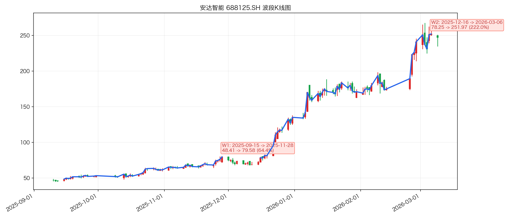
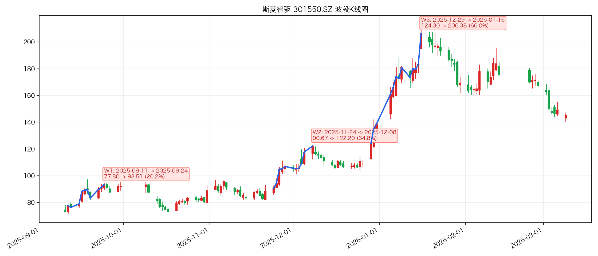
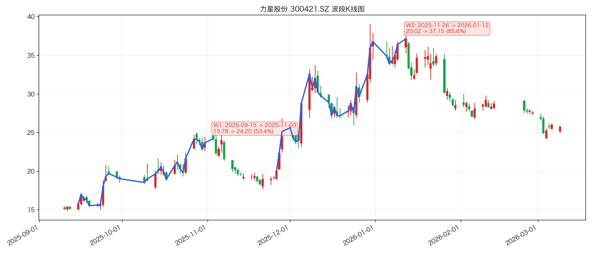

# 机器人概念首版概念归因

## 基础信息

- 概念代码：`885517.TI`
- 概念名称：`机器人概念`
- 分析区间：`2025-09-10` 到 `2026-03-09`
- 数据口径：
  - Top400 覆盖来自 `data/wencai_top400_20250910_20260309.csv`
  - 概念代表股初稿来自 `data/top400_thematic_concept_reps.csv`
  - 量价与概念映射来自本地 PostgreSQL `event_quant`
  - news 证据来自本地 PostgreSQL `event_news`
- 当前约束：
  - 当前 `conda base` 已可用 `pandas / psycopg / matplotlib / openpyxl`
  - 本次已补出三只样本的脚本波段图；概念结论主体仍以本地库事实与分层归因为主

## 一、样本校验与替换结论

### 1. 原始样本是否适合

| 角色 | 原样本 | 结论 | 主要理由 |
|---|---|---|---|
| 龙头 | `688125.SH 安达智能` | 保留 | Top400 排名 `2`、区间涨幅 `428.14%`，确实是机器人概念在本区间里的最强价格样本；与机器人概念收盘价相关系数 `0.847`。缺点是个股直连 news 较少，因此归因时要更依赖板块节奏。 |
| 中位 | `600869.SH 远东股份` | 替换 | 它的排名 `225` 很接近概念中位排名 `222`，但 stock+robot 命中仅 `23` 条、机器人零部件命中仅 `8` 条，主题纯度一般。 |
| 边缘 | `300480.SZ 光力科技` | 替换 | 它的排名 `202` 并不处在尾部层，不能代表“边缘/弱层”；且 stock+robot 命中为 `0`，更像概念映射覆盖到的泛科技票，不适合作为机器人概念尾层样本。 |

### 2. 最终采用样本

| 角色 | 最终样本 | 排名 | 区间涨幅 | 与机器人概念收盘价相关系数 | 替换/保留理由 |
|---|---|---:|---:|---:|---|
| 龙头 | `688125.SH 安达智能` | `2` | `428.14%` | `0.847` | 价格龙头地位明确，代表板块最强 alpha。 |
| 中位 | `301550.SZ 斯菱智驱` | `216` | `90.79%` | `0.879` | 距概念中位排名 `222` 很近，区间涨幅也接近概念中位涨幅 `90.03%`；stock+robot 命中 `70` 条、零部件命中 `57` 条，显著优于远东股份。 |
| 边缘 | `300421.SZ 力星股份` | `386` | `68.54%` | `0.571` | 真正处在 Top400 尾层，但仍有 stock+robot 命中 `74` 条、零部件命中 `69` 条，能代表“主题成立但弹性已明显下沉”的弱层样本。 |

## 二、概念画像先看结论

### 1. 板块广度

- Top400 中命中机器人概念的股票共有 `76` 只，按出现频次看属于高覆盖主题。
- 其中进入 Top50 的有 `12` 只，进入 Top100 的有 `13` 只，进入 Top200 的有 `35` 只。
- 区间涨幅超过 `100%` 的有 `31` 只，超过 `200%` 的有 `9` 只。
- 这说明机器人不是靠 1-2 只孤立妖股撑起来，而是存在真实的板块扩散。

### 2. 主线强度

- 机器人概念指数 `885517.TI` 区间仅上涨 `9.92%`，明显低于代表股的超额表现。
- 但概念内部股票的超额分布非常陡峭，说明这轮行情更像“强主线里的强分化”，而不是指数层面的整齐推进。
- 关键板块日宽度并不差：
  - `2025-11-05`：`76` 只样本中 `13` 只涨超 `5%`，`6` 只接近涨停
  - `2025-12-29`：`10` 只涨超 `5%`，`7` 只接近涨停
  - `2026-01-16`：`74` 只覆盖样本中 `22` 只涨超 `5%`，`9` 只接近涨停
  - `2026-02-24`：`76` 只样本中 `20` 只涨超 `5%`，`9` 只接近涨停
- 因此这轮更像“阶段性反复强化的主线”，而不是从头到尾持续单边上行的纯指数行情。

### 3. 强弱分层

- 强层：围绕人形机器人、谐波/丝杠/轴承、T 链卡位的高弹性票，涨幅远超概念指数，代表是安达智能、锋龙股份、飞沃科技等。
- 中层：基本面与机器人零部件逻辑更扎实，跟板块同涨同跌，但不会一直保持最强斜率，代表是斯菱智驱、远东股份、海伦哲一带。
- 弱层/尾层：主题成立但资金不再给最高溢价，只能跟随板块脉冲式补涨，代表是力星股份、中原内配、麦格米特一带。

## 三、三只样本的波段归因摘要

### 3.0 ChatGPT 审查补录

- 本轮已按 `stock-wave-attribution` + `chatgpt-plus-browser` 流程补做 ChatGPT 波段审查。
- 审查结果：
  - `688125.SH 安达智能`：`W1/W2` 均被判为 `merge_adjacent`，更适合合并成一段连续主升。
  - `301550.SZ 斯菱智驱`：`W1` 被判为 `up_valid`；`W2/W3` 均被判为 `merge_adjacent`，更适合作为同一轮主升处理。
  - `300421.SZ 力星股份`：`W1/W2` 均被判为 `merge_adjacent`，更像一段主升的前后半段。
- 联网归因状态：
  - 已多次使用 `submit-search` 补做 ChatGPT 联网归因。
  - 本轮改为复用原搜索会话，再追加一次“停止搜索、直接整理四段结论”的非搜索提示，已补齐三只样本可落文档的结构化正文。
  - 其中 `688125.SH` 与 `300421.SZ` 的固定四段正文来自同会话整理提示；`301550.SZ` 的原搜索回复本身已产出完整结构化结论，追加整理提示未继续展开。
  - 但 ChatGPT 仍只作为联网补强层，涉及主因/备选的最终裁决，仍以本地 `event_news / event_quant` 交叉验证后的结论为准。

## 3.1 龙头样本：安达智能 `688125.SH`

- 角色定位：板块价格龙头，不是 news 最密集的票，但能代表机器人概念最强 alpha。
- 主要波段：
  - 本地切段：`W1` `2025-09-15 -> 2025-11-28`，`48.41 -> 79.58`，涨幅约 `64.39%`
  - 本地切段：`W2` `2025-12-16 -> 2026-03-06`，`78.25 -> 251.97`，涨幅约 `222.01%`
  - ChatGPT 审查：`W1/W2 -> merge_adjacent`，更适合合并理解为 `2025-09-15 -> 2026-03-06` 的连续主升段
- 核心归因：
  - `W1` 更像机器人主题从“预期交易”进入“可配置主线”的预热段。`2025-11-04` 到 `2025-11-05`，库内出现机器人产业大会、对人形机器人产业趋势的强化表述，板块宽度同步抬升。
  - `W2` 是最关键主升，主因不是安达智能单独公告，而是 `2025-12-29` 前后机器人跨年主线强化。库内有“机器人概念涨势持续扩大”快讯，且 `2026-01-16` 板块出现 `22/74` 只涨超 `5%` 的宽度扩散。
  - `W3` 是春节后到 3 月初的再加速，主因仍是主题热度回流。`2026-02-23` 到 `2026-02-24`，库内出现机器人租赁出圈、具身智能融资、节后“科技-机器人依然是主线”等证据，板块再次扩散。
- 本地证据要点：
  - `2025-10-21` 两条广发机械跟踪里，安达智能被放入“人形/半导体都有积极进展”的关注名单。
  - `2025-12-29` `wscn_live` 直接确认机器人概念涨势扩大。
  - `2026-02-23` 节后多条机器人主线强化消息回流。
- ChatGPT 补充与边界：
  - ChatGPT 审查支持“整段合并”为连续主升，不支持把两段完全割裂理解。
  - ChatGPT 最终结构化主因：更偏向“人形机器人/高端机床/AI 服务器设备”相关题材对安达智能的预期重估与资金交易，而不是已兑现业绩驱动。
  - ChatGPT 备选：`2026-02-07` 越南设厂公告强化“出海扩产 + 海外交付能力提升”预期，更多是后半段助推，而非整段主升起点。
  - ChatGPT 搜索依据：`2025-11-27/11-28` 投关记录强调 AI 服务器尚未规模放量；`2025-12-24` 异动公告称无未披露重大信息；`2026-02-07` 对外投资公告披露越南基地；`2026-03-05` 行业研报/媒体把具身智能与概念走强继续绑定。
  - 交叉验证后可采信部分是“非业绩反转、以机器人主线和主题交易为主”；其中“AI 服务器/高端机床”属于 ChatGPT 扩展出来的更宽主题篮子，本地库里最强证据仍是机器人主线强化，因此该层记为“部分一致的辅助验证”。
- 裁决：
  - 安达智能的归因重心是“板块主升中的最强价格表达”，个股层证据次之。
- 波段图：
  - 

## 3.2 中位样本：斯菱智驱 `301550.SZ`

- 角色定位：更接近机器人零部件中军，能代表“主题纯度高、位置在中位、弹性仍强”的中层样本。
- 主要波段：
  - 本地切段：`W1` `2025-09-11 -> 2025-09-24`，`77.80 -> 93.51`，涨幅约 `20.19%`
  - 本地切段：`W2` `2025-11-24 -> 2025-12-08`，`90.67 -> 122.20`，涨幅约 `34.77%`
  - 本地切段：`W3` `2025-12-29 -> 2026-01-16`，`124.30 -> 206.38`，涨幅约 `66.03%`
  - ChatGPT 审查：`W1 -> up_valid`；`W2/W3 -> merge_adjacent`，即前导小波段 + 一段合并主升
- 核心归因：
  - `W1` 主要由 T 链量产预期、谐波减速器与交叉滚子轴承卡位预期驱动，属于“中位核心票被市场重新定价”的过程。
  - `W2` 是典型的机器人跨年主升。`2025-12-29` 库内既有斯菱智驱自身“启程拜访北美、谐波一供拭目以待”的直接更新，也有机器人概念涨势扩大的板块确认。
  - `2026-01-07` 到 `2026-01-18`，news 库继续强化“成为谐波核心供应商”“确定性协议即将签订，谐波绝对一供确定”等表述，说明它不是纯情绪票，而是景气和卡位预期共振。
- 本地证据要点：
  - `2025-12-29`：长江电新/机械/汽车更新，直接提到公司启程拜访北美客户、谐波一供预期强化。
  - `2025-12-29`：`wscn_live` 机器人概念涨势扩大，斯菱智驱涨超 `10%`。
  - `2026-01-07`：news 库直接把它描述为“成为谐波核心供应商后，市值扩张才迈出第一步”。
  - `2026-01-18`：news 库继续强化“谐波绝对一供确定”。
- ChatGPT 补充与边界：
  - ChatGPT 审查认可 `W1` 可以单列，`W2/W3` 应合并理解，这与本地“前导段 + 跨年主升段”的结构基本一致。
  - ChatGPT 最终结构化主因：上涨更像“机器人化叙事被连续坐实”驱动的主题重估，而不只是汽车轴承主业改善。
  - ChatGPT 备选：同期人形机器人板块风险偏好回升，放大了“精密轴承 + 谐波减速器 + 执行器模组”标的弹性。
  - ChatGPT 搜索依据：`2025-11-18` 公告收购银球科技股权、补强精密轴承；`2025-12-04` 调研纪要提到银球科技机器人应用、谐波减速器已可小批量生产；`2025-12-26/12-29` 公司更名为“斯菱智驱”；`2026-01-09` 调研纪要继续确认机器人零部件小批量生产阶段。
  - 交叉验证后，这与本地 `event_news` 中“北美客户进展、谐波/轴承卡位、跨年主升”的方向一致，属于三只样本里 ChatGPT 补强最完整、与本地证据一致性最高的一只；但“订单兑现”和“大批量供货已验证”仍不能上调到确定性表述。
- 裁决：
  - 斯菱智驱更能代表机器人概念的“中位核心层”，其上涨不是泛题材映射，而是零部件卡位预期被资金持续确认。
- 波段图：
  - 

## 3.3 边缘样本：力星股份 `300421.SZ`

- 角色定位：尾层样本，但仍然属于机器人零部件逻辑链，适合观察“板块成立时尾层能否跟涨、能涨到什么程度”。
- 主要波段：
  - 本地切段：`W1` `2025-09-15 -> 2025-11-03`，`15.78 -> 24.20`，涨幅约 `53.36%`
  - 本地切段：`W2` `2025-11-26 -> 2026-01-12`，`20.02 -> 37.15`，涨幅约 `85.56%`
  - ChatGPT 审查：`W1/W2 -> merge_adjacent`，更适合合并理解为 `2025-09-15 -> 2026-01-12` 的连续主升
- 核心归因：
  - `W1` 起点可追溯到 `2025-09-24` 的机器人链更新，news 库明确提到“新一代灵巧手微型丝杠拟采用陶瓷球，力星股份正协助浙江 tier1 开发相关产品”。
  - `W2` 主要由 T 链量产规划与新卡位叙事推动。`2025-10-14` 库内有“T 链量产规划格局清晰，调整后加仓新技术与新卡位”的板块级表述；`2025-10-29` 则直接出现“力星股份重点更新：将与 ZJRT 签约微型丝杠陶瓷球全面战略合作协议”。
  - `W3` 是跨年主线里尾层补涨，幅度仍可观，但持续性明显弱于龙头和中军，体现尾层样本的弱势特征。
- 本地证据要点：
  - `2025-09-24`：机器人链更新，首次把力星股份与灵巧手微型丝杠陶瓷球卡位绑定。
  - `2025-10-29`：直接出现“力星股份重点更新1029”。
  - `2025-12-25` 到 `2026-01-04`：跨年阶段机器人链继续有“新方案迭代”“量产时间表”类强化消息。
- ChatGPT 补充与边界：
  - ChatGPT 审查认可两段应合并理解，说明本地切段更偏保守。
  - ChatGPT 最终结构化主因：更偏向“人形机器人/高端轴承材料”主题持续发酵下，对“陶瓷球 + 机器人滚动体应用”方向的重估。
  - ChatGPT 备选：`2025-10-25` 三季报业绩边际改善提供基本面底座，但不足以单独解释整段涨幅。
  - ChatGPT 搜索依据：`2025-05-12` 投关记录提到产品已应用于人形机器人；`2025-10-25` 三季报显示利润同比小幅增长；`2025-12-09` 异动公告称无未披露重大事项；`2025-12-10` 媒体报道把 Optimius 审厂与机器人供应链交易强化绑定。
  - 交叉验证后只能记为“部分一致”：ChatGPT 给出了机器人主题重估方向，但最强官方依据 `2025-05-12` 明显早于本轮主升窗口，时间贴合度弱于本地 `event_news` 中 `2025-09-24`、`2025-10-29` 之后的窗口内证据，因此最终仍以本地归因为主。
- 裁决：
  - 力星股份是合格的边缘样本，因为它既不是无关泛概念票，也不是主升龙头，而是“主题成立时可以被尾层资金反复挖掘，但估值天花板明显更低”的那一层。
- 波段图：
  - 

## 四、概念级综合裁决

### 1. 这轮机器人概念有没有板块广度

- 有，而且不低。
- `76` 只覆盖样本、`35` 只进入 Top200、`31` 只区间翻倍，已经足以说明它不是孤立个股行情。

### 2. 这轮机器人概念是不是主线

- 是阶段性主线，但强度表现为“反复强化”，不是指数直线主升。
- 主题真正的强度来自个股层面的高弹性扩散，而不是概念指数本身。
- 如果只看概念指数 `+9.92%`，会严重低估这轮机器人行情的真实赚钱效应。

### 3. 这轮机器人概念的强弱分层是否清晰

- 很清晰。
- 龙头层拿走最大溢价，中位核心层吃到趋势溢价，尾层更多依赖事件脉冲和板块回流做补涨。
- 因此后续做策略卡时，不能把“机器人概念”当成单一篮子去看，必须拆成：
  - 价格龙头层
  - 核心零部件中军层
  - 尾层补涨层

### 4. 本轮首版最重要的认识

- 机器人概念在 Top400 里体现出的是“高覆盖 + 高分化”。
- 概念指数不强，不代表主线不强；相反，这里更像需要做层级选股，而不是简单买概念指数。
- 从策略角度看，机器人这轮更适合做“强层确认后向中层扩散，再在尾层找补涨”的分层跟踪，而不是平均化配置。

## 五、当前缺口

- 当前 `conda base` 依赖已补齐，本版已复用 `wave_segmentation.py` 与 `wave_plotting.py` 产出三只样本的正式波段图。
- 本版已使用 ChatGPT Plus browser 完成波段审查补录，并补齐三只样本的结构化联网归因正文。
- 其中安达智能、力星股份的最终四段正文来自“同会话整理提示”，斯菱智驱则直接复用了原搜索回复中已完整生成的结构化结论。
- 搜索层仍只作为辅助核验，不替代本地数据库结论；三只里以斯菱智驱的一致性最高，安达智能与力星股份均只达到“部分一致”。
- `Top201-400` 虽已具备概念层分析条件，但个股级一优先量价细项并未对全部股票系统化补齐，后续若要把尾层样本做成正式单票报告，建议再补细项数据和图。
