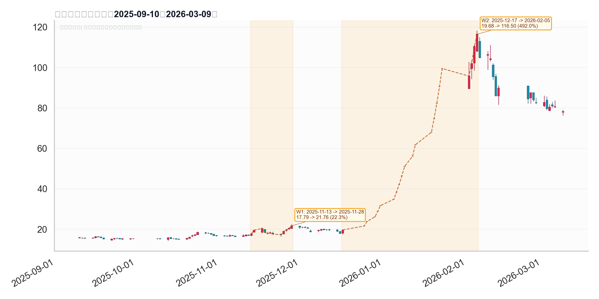

# 锋龙股份波段归因

## 基础信息

- 标的名称：锋龙股份
- 股票代码：`002931.SZ`
- 分析窗口：`2025-09-10` 到 `2026-03-09`
- 样本来源：`data/top400_theme_concept_top15_random3.csv`
- 样本标签：`新能源汽车`
- Top400 rank：`3`
- Top400 原始时间窗：`2025-09-10` 到 `2026-03-09`
- Top400 原始区间涨幅_前复权_pct：`391.21%`
- 本报告量价主口径：`event_quant.raw_stock_daily_qfq`
- 一句话逻辑：`前段由优必选量产交付与订单预期带来机器人主题预热，主升段由优必选入主锋龙触发控制权变更/机器人双叙事，再被跨年机器人主线和壳资源情绪放大。`

说明：

- `event_quant` 按窗口首尾收盘前复权价计算，`2025-09-10` 到 `2026-03-09` 的实际区间涨幅约为 `399.36%`；与 Top400 文件的 `391.21%` 存在轻微口径差异，本报告的量价分析以本地 PostgreSQL 日线为准。
- 本次优先使用本地 PostgreSQL，实际连通数据库为：
  - `postgresql://zhengshenghua@localhost:5432/event_quant`
  - `postgresql://zhengshenghua@localhost:5432/event_news`

## 波段列表

- `W1`
  - 波段区间：`2025-11-13` 到 `2025-11-28`
  - 价格区间：`17.79 -> 21.76`
  - 波段涨幅：`22.32%`
  - bars：`12`
  - 是否进入归因分析：`yes`
- `W2`
  - 波段区间：`2025-12-17` 到 `2026-02-05`
  - 价格区间：`19.68 -> 116.50`
  - 波段涨幅：`491.97%`
  - bars：`22`
  - 是否进入归因分析：`yes`

波段图：



## W1 波段

- 波段区间：`2025-11-13` 到 `2025-11-28`
- 价格区间：`17.79 -> 21.76`
- 波段涨幅：`22.32%`
- 波段审查：
  - 规则切段结论：`预热上涨段`
  - 结合量价与消息节奏的人工作业结论：`up_valid`
  - 说明：`这段不是持续主升，但具备两次涨停、放量冲高和快速修复的完整上冲结构，应作为主升前的独立预热段保留。`
- 是否进入归因分析：`yes`

### ChatGPT 联网归因

- 主因：
  `2025-11-25｜产业催化 / 主题预热｜锋龙股份在无公司级新增硬公告配合的情况下，被市场按“业绩改善 + 新能源汽车零部件 + 机器人概念”做主题强化，叠加 11 月 13 日到 11 月 17 日已触发异常波动并登上龙虎榜，因此这段更像产业催化 / 主题预热驱动，而不是公司实质性新事件驱动。`
- 备选：
  `2025-11-17 之后，短线资金沿“通用设备活跃 + 小市值弹性 + 情绪接力”继续推升股价至 11 月 27 日，但公司公告已明确当时不存在应披露未披露重大事项，因此备选解释仍应归类为资金博弈主导，而不是公司基本面突变。`
- 搜索依据：
  `1) 2025-11-13｜数据平台 / 股东高管数据｜东方财富高管持股页面显示锋龙股份当日有高管持股变动记录，窗口初段并非由明确利好公告触发；2) 2025-11-17｜公司公告｜《股票交易异常波动公告》确认 11 月 13 日、14 日、17 日连续 3 个交易日涨幅偏离值累计超 20%，并明确“未发现近期公共媒体报道未公开重大信息”“不存在应披露而未披露重大事项”；3) 2025-11-17｜交易所公开交易数据 / 龙虎榜｜同花顺龙虎榜显示锋龙股份因连续三个交易日内涨幅偏离值累计达 20% 上榜，说明窗口前半段已有明显情绪资金参与；4) 2025-11-25｜媒体 / 行情解读｜证券之星当日涨停分析将驱动归因为“业绩暴增、新能源车及机器人概念驱动”，并提到主力资金净流入，符合主题扩散特征；5) 2025-11-27｜行情快讯 / 盘口异动｜东方财富 Choice 数据显示锋龙股份盘中涨幅达 5%，成交 2.69 亿元、换手率 6.64%，说明窗口尾段仍主要体现资金推动的延续上涨。`

## W2 波段

- 波段区间：`2025-12-17` 到 `2026-02-05`
- 价格区间：`19.68 -> 116.50`
- 波段涨幅：`491.97%`
- 波段审查：
  - 规则切段结论：`主升段`
  - 结合量价与消息节奏的人工作业结论：`up_valid`
  - 说明：`12-17 停牌前涨停给出事件锚点，12-25 复牌后一字连板并延续到 1 月下旬，随后 2 月初高位震荡再冲顶，形态上是典型事件驱动型主升。`
- 是否进入归因分析：`yes`

### ChatGPT 联网归因

- 主因：
  `2025-12-24 晚披露、2025-12-25 复牌落地的“优必选协议受让 29.99% 股份 + 后续 13.02% 部分要约、控制权拟变更”是这段主升浪的核心驱动；市场实际交易的是“优必选入主锋龙股份”带来的机器人 / 壳资源想象，复牌后一字连板与该事件时间点高度重合，而不是公司原有主业景气突变。`
- 备选：
  `机器人主题情绪与“人形机器人第一股 H 吃 A”叙事共振放大了控制权变更题材弹性，但更像主因的情绪放大器，而非独立基本面主线。`
- 搜索依据：
  `1) 2025-12-25｜公司公告｜《关于筹划控制权变更暨复牌的公告》：12 月 17 日因控制权变更筹划停牌，12 月 24 日签署股份转让协议，12 月 25 日复牌；2) 2025-12-25｜公司公告｜《关于控股股东、实际控制人股份转让暨控制权拟发生变更和权益变动的提示性公告》：优必选拟受让 29.99% 股份，后续发起 13.02% 部分要约，控股股东拟变更为优必选、实控人拟变更为周剑；3) 2026-01-19｜公司公告｜《关于股票交易停牌核查结果暨复牌的公告》：公司确认自 2025-12-25 至 2026-01-13 已连续 12 个交易日涨停、涨幅 213.97%，同时明确主营未变、未来 36 个月无重组上市计划、未来 12 个月无资产重组计划、截至当时无资产注入计划；4) 2026-01-21｜公司公告｜《股票交易异常波动暨风险提示公告》：自 2025-12-25 至 2026-01-20 已连续 14 个交易日涨停、涨幅 279.93%，公司再次强调股价严重脱离基本面、本次交易尚未发生实质性进展；5) 2026-01-23｜监管 / 媒体转引深交所｜深交所对相关异常交易投资者采取暂停交易等自律监管措施；同日报道回溯称，锋龙股份近期连续涨停与优必选入主消息密切相关。`
- 证据不足项：
  `在限定窗口及前后 10 个自然日内，未搜索到能够单独支撑这段 491.97% 涨幅的业绩爆发、重大订单落地或资产注入实锤；相反，公司在 2026-01-19、2026-01-21、2026-01-26、2026-02-02 连续公告提示主营未变、无资产注入 / 无重组上市计划，因此更稳妥的结论仍是“优必选入主预期 + 机器人壳资源情绪炒作”主导。`

## 本地 news 库证据

| 序号 | 时间 | 来源 | 标题 | 链接 |
|---|---|---|---|---|
| 1 | 2025-11-12 18:54 | `wscn_live` | 优必选首批数百台全尺寸工业人形机器人Walker S2正式开启量产交付 | [link](https://wallstreetcn.com/livenews/3003377) |
| 2 | 2025-11-25 08:43 | `wscn_live` | 优必选中标2.64亿元人形机器人项目 | [link](https://wallstreetcn.com/livenews/3009840) |
| 3 | 2025-11-27 22:15 | `zsxq_damao` | 【优必选】更新：上调人形出货预期，量产交付有序推进 | [link](https://api.zsxq.com/v2/topics/55188124845482244) |
| 4 | 2025-12-17 19:41 | `wscn_live` | 锋龙股份：公司控股股东及实控人正在筹划公司控制权变更相关事宜，该事项可能导致公司控股股东、实际控制人发生变更，股票停牌。 | [link](https://wallstreetcn.com/livenews/3022395) |
| 5 | 2025-12-25 00:47 | `wscn_live` | A股迎来“人形机器人第一股”：16.65亿元并购，优必选成为锋龙股份控股股东 | [link](https://wallstreetcn.com/livenews/3026294) |
| 6 | 2025-12-30 21:01 | `zsxq_damao` | 周二舆情热度：①人形机器人 | [link](https://api.zsxq.com/v2/topics/45811814552544258) |
| 7 | 2026-01-07 19:49 | `zsxq_damao` | 【9连板锋龙股份：如股票价格进一步异常上涨可能申请停牌核查 未来36个月内优必选不存在通过上市公司重组上市的计划或安排】 | [link](https://api.zsxq.com/v2/topics/45811815214421528) |
| 8 | 2026-01-19 11:06 | `zsxq_damao` | 优必选与空客达成合作 人形机器人落地航空制造场景 | [link](https://api.zsxq.com/v2/topics/14588452214518212) |
| 9 | 2026-02-01 15:40 | `wscn_live` | 锋龙股份：停牌核查完成，优必选承诺在本次收购完成后36个月内，不存在向上市公司注入其所持有资产的计划，股票复牌。 | [link](https://wallstreetcn.com/livenews/3047777) |

### 证据原文

#### 证据 1
- 时间：`2025-11-12 18:54`
- 来源：`wscn_live`
- 标题：优必选首批数百台全尺寸工业人形机器人Walker S2正式开启量产交付
- 链接：[link](https://wallstreetcn.com/livenews/3003377)
- 原文：
```text
优必选首批数百台全尺寸工业人形机器人Walker S2正式开启量产交付，将分批投入产业一线应用。2025年初至今，优必选Walker系列人形机器人累计订单金额已突破8亿元。（界面）
```

#### 证据 2
- 时间：`2025-11-25 08:43`
- 来源：`wscn_live`
- 标题：优必选中标2.64亿元人形机器人项目
- 链接：[link](https://wallstreetcn.com/livenews/3009840)
- 原文：
```text
11月21日，优必选中标广西防城港市人形机器人数据采集与测试中心和人工智能科创教育示范项目，中标金额2.64亿元，产品以最新款可自主换电的工业人形机器人Walker S2为主。该项目将聚焦人形机器人在全国边境口岸的旅客和人员疏导、岗哨巡检、物流、商业服务以及国内钢铜铝大型生产制造基地的设施巡检等项目。订单预计在12月交付。截至目前，2025年优必选Walker系列人形机器人全年订单总金额达11亿元（不含全尺寸科研教育人形机器人天工行者和小型人形机器人AI悟空）。
```

#### 证据 3
- 时间：`2025-11-27 22:15`
- 来源：`zsxq_damao`
- 标题：【优必选】更新：上调人形出货预期，量产交付有序推进
- 链接：[link](https://api.zsxq.com/v2/topics/55188124845482244)
- 原文：
```text
【优必选】更新：上调人形出货预期，量产交付有序推进

上调WalkerS系列出货预期公司WalkerS系列人形机器人订单持续突破，11月以来陆续披露3个大额数采项目订单（自贡项目1.59e、广西防城港项目2.64e、九江项目1.43e），截至目前全年总订单达11亿元，订单超出此前预期。全年WalkerS系列出货量预计将从500台抬升至600-700台。

产能爬坡、量产交付顺利目前公司深圳工厂人形日产能10-15台，预计年底将逐步爬坡至400台/月，产能饱满，订单交付目标有保障。未来新工厂产能释放将进一步提升交付能力。

我们的观点：公司持续推进人形机器人在工业、商业等场景的落地，具有商业闭环价值，大额订单持续落地再次印证其商业化能力。本体厂商产品价值量高且接近终端客户，在产业链中地位显著，品牌力凸显；未来宇树等机器人企业上市也有望带来本体厂商价值重估，建议关注。
```

#### 证据 4
- 时间：`2025-12-17 19:41`
- 来源：`wscn_live`
- 标题：锋龙股份：公司控股股东及实控人正在筹划公司控制权变更相关事宜，该事项可能导致公司控股股东、实际控制人发生变更，股票停牌。
- 链接：[link](https://wallstreetcn.com/livenews/3022395)
- 原文：
```text
锋龙股份：公司控股股东及实控人正在筹划公司控制权变更相关事宜，该事项可能导致公司控股股东、实际控制人发生变更，股票停牌。
```

#### 证据 5
- 时间：`2025-12-25 00:47`
- 来源：`wscn_live`
- 标题：A股迎来“人形机器人第一股”：16.65亿元并购，优必选成为锋龙股份控股股东
- 链接：[link](https://wallstreetcn.com/livenews/3026294)
- 原文：
```text
锋龙股份公告，公司控股股东将由诚锋投资变更为优必选，公司股票自12月25日起复牌。锋龙股份公告显示，公司股东诚锋投资、董剑刚、锋驰投资、厉彩霞与优必选签署股份转让协议，约定诚锋投资向优必选协议转让上市公司合计6552.99万股无限售条件流通股股份，占上市公司总股本的29.99%，公告显示每股转让价格为人民币17.72元，股份转让价款总额为人民币11.61亿元。
```

#### 证据 6
- 时间：`2025-12-30 21:01`
- 来源：`zsxq_damao`
- 标题：周二舆情热度：①人形机器人
- 链接：[link](https://api.zsxq.com/v2/topics/45811814552544258)
- 原文：
```text
周二舆情热度：

①人形机器人-四部门：推动智能机器人在焊接、喷涂、总装等环节规模化应用 打造汽车行业具身智能示范产线；宇树全国首店将于12月31日在北京京东MALL开业；（长盈精密、锋龙股份、天奇股份、五洲新春、万向钱潮、浙江荣泰等）

②AI应用端-据报道，Meta以数十亿美元收购开发AI应用Manus；官宣！火山引擎成为总台春晚独家AI云合作伙伴；（酷特智能、昆仑万维、润欣科技、南兴股份、万兴科技、中文在线等）

③算力/液冷-近日，新型塔式液冷服务器在合肥发布，能稳定运行DeepSeek大模型推理任务；（同飞股份、英维克、申菱环境、宏英智能、冰山冷热、奕东电子、同星科技等）

④商业航天-国防科工局：促进商业航天发展推动航天产业化；上交所发布商业火箭企业IPO指引；（乾照光电、顺灏股份、华力创通、泰胜风能、天银机电、航天机电、航天发展、航天动力等）

⑤AI教育-教育部：计划明年出台人工智能赋能教育相关政策文件 系统部署推进人工智能教育和应用；（万兴科技、科大讯飞、新开普、豆神教育、凯文教育、竞业达、佳发教育、金山办公等）

⑥数字货币-中国人民银行将出台《关于进一步加强数字人民币管理服务体系和相关金融基础设施建设的行动方案》。（四方精创、御银股份、航天信息、数字认证、飞天诚信、东信和平、海联金汇等）
```

#### 证据 7
- 时间：`2026-01-07 19:49`
- 来源：`zsxq_damao`
- 标题：【9连板锋龙股份：如股票价格进一步异常上涨可能申请停牌核查 未来36个月内优必选不存在通过上市公司重组上市的计划或安排】
- 链接：[link](https://api.zsxq.com/v2/topics/45811815214421528)
- 原文：
```text
19:38:10
【9连板锋龙股份：如股票价格进一步异常上涨可能申请停牌核查 未来36个月内优必选不存在通过上市公司重组上市的计划或安排】财联社1月7日电，锋龙股份(002931.SZ)公告称，公司股票自2025年12月25日至2026年1月7日连续8个交易日涨停，累计涨幅偏离值超过100%，显著偏离大盘指数，短期波动幅度较大，已明显偏离市场走势，存在较高的炒作风险，如未来公司股票价格进一步异常上涨，公司可能申请停牌核查，投资者参与交易可能面临较大风险，敬请广大投资者务必充分了解二级市场交易风险，切实提高风险意识。优必选暂无在未来12个月内改变上市公司主营业务或者对上市公司主营业务做出重大调整的明确计划，以及在未来12个月内对上市公司及其子公司的重大资产和业务进行出售、合并、与他人合资或合作的明确计划，或上市公司拟购买或置换重大资产的明确重组计划。未来36个月内，优必选不存在通过上市公司重组上市的计划或安排；未来12个月内，优必选不存在资产重组计划。
```

#### 证据 8
- 时间：`2026-01-19 11:06`
- 来源：`zsxq_damao`
- 标题：优必选与空客达成合作 人形机器人落地航空制造场景
- 链接：[link](https://api.zsxq.com/v2/topics/14588452214518212)
- 原文：
```text
优必选与空客达成合作 人形机器人落地航空制造场景，港股优必选大涨，锋龙股份大单一字，
关注：天奇股份，珠城科技，商洛电子，拓邦股份
```

#### 证据 9
- 时间：`2026-02-01 15:40`
- 来源：`wscn_live`
- 标题：锋龙股份：停牌核查完成，优必选承诺在本次收购完成后36个月内，不存在向上市公司注入其所持有资产的计划，股票复牌。
- 链接：[link](https://wallstreetcn.com/livenews/3047777)
- 原文：
```text
锋龙股份：停牌核查完成，优必选承诺在本次收购完成后36个月内，不存在向上市公司注入其所持有资产的计划，股票复牌。
```
## 量价与概念验证

- 个股窗口涨幅（event_quant 口径）：`399.36%`
- W1 量价特征：
  `12 个交易日上涨 22.32%，平均换手率 9.74%，最大换手率 20.69%，两次涨停，说明这段已有明显资金试盘和情绪预热，但并未形成持续连板主升。`
- W2 量价特征：
  `22 个交易日上涨 491.97%，其中 18 个交易日涨幅 >= 9.9%；若只看 2025-12-25 到 2026-01-23 的核心段，则是 17 个交易日里 17 次涨幅 >= 9.9% 的连续一字/近一字加速结构，典型事件驱动型主升。`
- top5 候选概念（全窗口）：

| 概念 | 代码 | 区间涨幅 | 收盘价相关系数 | 日收益率相关系数 |
|---|---|---:|---:|---:|
| 金属制品 | `884075.TI` | `24.0906%` | `0.9346` | `0.3658` |
| 新能源汽车 | `885431.TI` | `12.8623%` | `0.8877` | `0.2964` |
| 股权转让(并购重组) | `885739.TI` | `10.9672%` | `0.8767` | `0.3563` |
| 机器人概念 | `885517.TI` | `9.9193%` | `0.8641` | `0.3079` |
| 长安汽车概念 | `886061.TI` | `8.2063%` | `0.8284` | `0.3311` |

- 分段概念观察：
  `W1 子段里 5 个候选概念指数区间收益全部为负，但锋龙逆势上涨 22.32%，说明这更像个股资金预热和局部题材映射，而不是板块普涨。W2 子段里“股权转让(并购重组)”与“机器人概念”同时保持较高日收益率相关性，说明主升段是公司事件和机器人主线共振，不是单一新能源汽车逻辑。`
- 量价结论：
  `从样本池来源看，锋龙属于“新能源汽车”概念样本没有问题；但从真正解释涨幅的驱动看，新能源汽车只是选样标签，不是本轮 5 倍主升的主因。决定性力量是优必选入主带来的平台想象空间，以及机器人主线在跨年阶段对该想象空间的放大。`

## 综合裁决

- 主因：
  `2025-12-24 起｜控制权变更 / 机器人平台化叙事｜优必选入主锋龙，把公司从普通零部件标的重定价为“优必选 A 股平台 + 人形机器人第一股”映射标的，这是主升段真正的起爆点。`
- 备选：
  `2025-12-30 起｜机器人跨年主线强化｜四部门推动智能机器人示范产线、优必选后续合作落地、板块跨年情绪升温，使锋龙从事件票升级为机器人抱团高度板。`
- 最终判定：
  `优必选入主事件驱动为主，机器人跨年主线放大为辅，新能源汽车标签仅解释样本来源，不解释主升本身。`
- 结论说明：
  `W1 更像优必选产业进展驱动的预热段，说明市场在 11 月已经开始给优必选链和机器人本体厂更高风险偏好；但真正把锋龙做成现象级行情的是 W2：12 月 17 日控制权变更停牌给出事件锚，12 月 24 日优必选入主公告落地，随后跨年机器人主线把“壳资源 + 人形机器人平台”叙事推到极致。即便公司多次澄清未来 36 个月不存在重组上市或资产注入安排，股价仍连续一字板上冲，进一步证明本轮行情核心是事件驱动叠加主题情绪，而非基本面兑现。`
- 置信度：
  `高`

## 备注

- 本次报告已按要求优先使用本地 PostgreSQL；`event_news` 与 `event_quant` 连接成功。
- 项目内 `chatgpt-plus-browser` 历史任务曾因会话复用和状态识别问题出现 `generating/queued` 假性超时；隔离修复并补齐“等到 `喵喵` 再判定完成”的规则后，已从独立新会话搜索任务 `2898cca6-c181-4228-9b38-3492a9b1977e` 取回 W1 的可用结构化结果，并从任务 `2826e5b9-d487-4564-94c2-fbe8dfbe9408` 取回 W2 的可用结构化结果，两段均已回填到本报告。
- 本次正式交付文件与配图：
  - `docs/analysis/2026-03-20-002931SZ-锋龙股份-wave-attribution.md`
  - `data/plots/002931_SZ_wave_candles.png`
