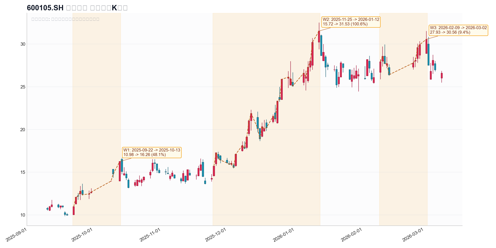

# 永鼎股份波段归因

## 基础信息

- 标的名称：永鼎股份
- 股票代码：`600105.SH`
- 分析窗口：`2025-09-10` 到 `2026-03-09`
- 样本来源：`Top400` 去噪后概念 `Top15` 随机样本池，样本标签概念为 `军工`；`Top400 rank=82`，窗口涨幅 `146.43%`
- 数据来源：
  - [top400_theme_concept_top15_random3.csv](../../data/top400_theme_concept_top15_random3.csv)
  - [wencai_top400_20250910_20260309.csv](../../data/wencai_top400_20250910_20260309.csv)
- 一句话逻辑：`前段由可控核聚变/高温超导带材催化启动，后段由光芯片验证、鼎芯增资扩股与光通信/CPO景气共振接力，形成“超导 + 光通信”双主线重估；样本池中的“军工”更像入口标签，不是最强主因。`

## 波段列表

- `W1`
  - 波段区间：`2025-09-22` 到 `2025-10-13`
  - 价格区间：`10.98 -> 16.26`
  - 波段涨幅：`48.09%`
  - bars：`10`
  - 是否进入归因分析：`yes`
- `W2`
  - 波段区间：`2025-11-25` 到 `2026-01-12`
  - 价格区间：`15.72 -> 31.53`
  - 波段涨幅：`100.57%`
  - bars：`33`
  - 是否进入归因分析：`yes`
- `W3`
  - 波段区间：`2026-02-09` 到 `2026-03-02`
  - 价格区间：`27.93 -> 30.56`
  - 波段涨幅：`9.42%`
  - bars：`10`
  - 是否进入归因分析：`no`
- 审查结论
  - `W1 -> up_valid`
  - `W2 -> up_valid`
  - `W3 -> noise`
  - `W1/W2 -> no merge`

波段图：



## W1 波段

- 波段区间：`2025-09-22` 到 `2025-10-13`
- 价格区间：`10.98 -> 16.26`
- 波段涨幅：`48.09%`
- 审查结论：
  - 规则切段结论：`上涨波段`
  - 结合量价、回撤和消息节奏的人工作业结论：`up_valid`
- 是否进入归因分析：`yes`

### ChatGPT 联网归因

- 当前状态：
  `隔离修复后，已从二次短 prompt 重试任务 d560baff-e4c9-43fb-90c1-f6f9c76aafff 取回可用联网归因结果。原总任务 4ec86e01-8dc3-44a1-af94-23cba9c37a01 与拆分任务 3c907feb-89f6-478f-ad57-8867560d54e8 仍可视为历史失败记录，但不再阻塞本报告闭环。`
- 主因：
  `2025-09-22 ~ 2025-10-13｜可控核聚变主线驱动的题材拉升｜核心是东部超导在 2025-09-25 发布 HF1200 核聚变专用高温超导带材性能突破，随后 10 月 9 日节后核聚变板块在 BEST 项目进展与 FEC2025 会议预期催化下集体爆发，永鼎股份被直接作为板块标的交易。`
- 备选：
  `超导 / 军工等泛科技情绪扩散可能对 10 月上旬加速有放大作用，但公开证据强度弱于“核聚变产业催化 + 公司超导材料映射”主线。`
- 搜索依据：
  `1) 2025-09-24｜公司异常波动公告｜9 月 19 日、22 日、23 日连续异动且公司称无未披露重大事项；2) 2025-09-25｜子公司官网 / 技术发布｜HF1200 核聚变专用高温超导带材推出，且产品已应用于可控核聚变；3) 2025-10-10｜财经媒体 / 行业报道｜10 月 9 日核聚变板块掀涨停潮，永鼎股份在列，催化包括 BEST 关键部件落位和 FEC2025 预期。`
- 证据不足项：
  `未搜到该窗口及前后 10 日内足以单独解释整段上涨的重大订单、业绩预告或资产重组公告，因此 W1 更接近“行业主题催化下的映射行情”，不是单一公司事件驱动。`

### 本地 news 库证据

| 序号 | 时间 | 来源 | 标题 | 链接 |
|---|---|---|---|---|
| 1 | 2025-09-22 17:34 | `zsxq_zhuwang` | 【招商机械】继续看好核聚变板块beta | [link](https://api.zsxq.com/v2/topics/2854524184154551) |
| 2 | 2025-09-24 21:58 | `zsxq_damao` | 上海新建“环流四号”，再添重磅高温超导堆，继续强call永鼎 | [link](https://api.zsxq.com/v2/topics/2854521215842821) |
| 3 | 2025-09-26 11:22 | `zsxq_damao` | 继续call永鼎股份：子公司东部超导技术重大突破，超导带材出货量环比翻倍 | [link](https://api.zsxq.com/v2/topics/8854545522411112) |
| 4 | 2025-10-08 15:11 | `zsxq_zhuwang` | 【国金机械】国庆期间核聚变、量子均有明显催化 | [link](https://api.zsxq.com/v2/topics/1521214554525542) |

### 证据原文

#### 证据 1
- 时间：`2025-09-22 17:34`
- 来源：`zsxq_zhuwang`
- 标题：【招商机械】继续看好核聚变板块beta
- 链接：[link](https://api.zsxq.com/v2/topics/2854524184154551)
- 原文：
```text
【招商机械】继续看好核聚变板块beta❗

Q4核聚变将迎来密集催化期，建议关注相关零部件公司订单落地情况~

# 核心标的
[太阳]合锻智能: 合肥链核心公司，卡位好，价值量高，布局多个技术路径
[太阳]景业智能: 氚生产循环智能装备+检维修智能机械手，今年有望获1e+订单
[太阳]新风光: 有望受益于10月份合肥电源系统招标，供等离子体控制电源
[太阳]永鼎股份: 高温超导带材核心供应商，良率及产能持续提升中
[太阳]派克新材: 今年预计核聚变订单1e+，主业3-4e利润，安全垫厚
[太阳]联创光电: 长线票，星火一号项目链主公司，项目进展有序
```

#### 证据 2
- 时间：`2025-09-24 21:58`
- 来源：`zsxq_damao`
- 标题：上海新建“环流四号”，再添重磅高温超导堆，继续强call永鼎
- 链接：[link](https://api.zsxq.com/v2/topics/2854521215842821)
- 原文：
```text
🔥【GJJX】上海新建“环流四号”，再添重磅高温超导堆，继续强call永鼎！

[礼物]中国聚变能源（注册资本150e、正式挂牌）正式公开亮相，国内新增聚变高温超导堆，本次新堆成立有望再度上修高温超导需求CAPEX！

[礼物]高温超导单个堆CAPEX超过150e，其中高温超导磁体环节价值量占比超过40%，上游磁材价值量超过20%，高温超导带材属于聚变产业链供需最错配环节，长线看好。

[礼物]重磅催化在即：上海超导6月处于IPO报材料阶段，预计年内上市，龙头上市带动产业市值扩容！

‼️投资建议：首推永鼎股份【#高温带材稀缺供应商&光芯片进展超预期】，联创光电【高温超导带材】！
```

#### 证据 3
- 时间：`2025-09-26 11:22`
- 来源：`zsxq_damao`
- 标题：继续call永鼎股份：子公司东部超导技术重大突破，超导带材出货量环比翻倍
- 链接：[link](https://api.zsxq.com/v2/topics/8854545522411112)
- 原文：
```text
继续call永鼎股份：子公司东部超导技术重大突破，超导带材出货量环比翻倍！

 [礼物]  事件：子公司东部超导在EUCAS2025大会上重磅推出 HF1200 核聚变专用高性能超导带材，关键性能指标实现历史重大突破（目前良率已超70%）。

 [玫瑰]  超导：良率提升、出货高增，重视产业趋势拐点：1）技术：根据我们跟踪，公司高温超导带材良率已提升至70%+，技术持续突破；2）出货量拐点上行：从月度出货来看，6-8月出货量50-100km，9月出货量近200km，环比翻倍出货！#明年公司产能5000km+，超导带材有望进入出货爆发期。

 [玫瑰]  光芯片：子公司鼎芯光电是100g eml光芯片稀缺供应商，近期与头部光模块公司进展顺利，详情私信。

‼️永鼎股份长线看300e+市值，后续光芯片、核聚变领域催化不断，长线看好！
```

#### 证据 4
- 时间：`2025-10-08 15:11`
- 来源：`zsxq_zhuwang`
- 标题：【国金机械】国庆期间核聚变、量子均有明显催化
- 链接：[link](https://api.zsxq.com/v2/topics/1521214554525542)
- 原文：
```text
【国金机械】国庆期间核聚变、量子均有明显催化，在此对两个板块进行梳理和重申观点！

#【核聚变】@国内BEST进入关键阶段，目标2030年发电，海外德国进军聚变

1⃣ 国内：10.1日BEST项目杜瓦底座精准落位，且明确2030年有望通过聚变点亮第一盏灯。 
2⃣ 海外：10.2日德国政府宣布“德国迈向核聚变发电站”行动方案，规划投资20e欧元建设全球首座聚变发电站。
📮 下周“世界核聚变大会”将在成都举办（意义非凡，本次为第30届会议，上次我国举办在2006年），四季度聚变高频催化值得期待！

📈 投资建议：#首推永鼎股份（高温超导+光芯片-持续call），重点关注合锻智能（BEST充分受益）、杭氧股份（制冷总成+订单落地）、爱科赛博、新风光、天工国际（H股）等。

 【量子计算】@  量子领域荣获2025诺奖+美股暴涨，继续关注国内核心铲子股！

1⃣ 10.7日，约翰·克拉克等三人因“发现电回路中的宏观量子力学隧道效应和能量量子化”获2025年诺贝尔物理学奖！
2⃣ 三位获奖者核心贡献分别为超导电路测量、高保真量子比特测控（超导计算机主流架构），继续重视 超导路线核心铲子环节——稀释制冷机。 
3⃣ 美股假期继续暴涨：RGTI、QBTS、ARQQ、IONQ近5日涨幅分别达到+47%、+44%、+42%、+28%，第二浪已形成。

📈 投资建议：首推国盾量子（量子计算机整机）、禾信仪器（稀释制冷机+低温线缆）、普源精电、富士达。
```
### 量价与概念验证

- 个股窗口涨幅：`48.09%`
- top5 候选概念：

| 概念 | 代码 | 区间涨幅 | 收盘价相关系数 | 日收益率相关系数 |
|---|---|---:|---:|---:|
| 超导概念 | `886038.TI` | `13.1325%` | `0.9664` | `0.6245` |
| 可控核聚变 | `886065.TI` | `11.4103%` | `0.9477` | `0.5982` |
| 核电 | `885571.TI` | `4.8539%` | `0.9154` | `0.3744` |
| 海工装备 | `885426.TI` | `3.8028%` | `0.9024` | `0.1327` |
| 风电 | `885641.TI` | `3.5128%` | `0.8801` | `-0.0210` |
- 量价结论：
  `W1 与超导概念、可控核聚变的同步性最强，且显著强于样本入口标签“军工”。个股 48% 的涨幅远超概念指数 11%-13%，说明它不是单纯跟涨，而是被资金当作聚变高温超导材料链的高弹性表达。`

## W2 波段

- 波段区间：`2025-11-25` 到 `2026-01-12`
- 价格区间：`15.72 -> 31.53`
- 波段涨幅：`100.57%`
- 审查结论：
  - 规则切段结论：`上涨波段`
  - 结合量价、消息与回撤结构的人工作业结论：`up_valid`
- 是否进入归因分析：`yes`

### ChatGPT 联网归因

- 当前状态：
  `隔离修复后，已从二次短 prompt 重试任务 d560baff-e4c9-43fb-90c1-f6f9c76aafff 取回可用联网归因结果。历史任务 4ec86e01-8dc3-44a1-af94-23cba9c37a01 与 56c4b629-3418-4466-b08e-c1ca85a8debd 的失败不再影响本段闭环。`
- 主因：
  `2025-11-25 ~ 2026-01-12｜双题材共振｜这段更像“可控核聚变主线反复强化、光通信 / 光芯片预期接力”的双题材共振，其中核聚变是起涨锚点，12 月中旬后公司光通信全链条与光芯片能力被机构交流进一步强化，推动波段继续上行。`
- 备选：
  `控股股东 2025-12-20 提前终止减持计划，以及 12 月 22 日鼎芯光电引入外部投资者，也可能作为资金面和估值预期强化项，但更像助推而非起涨主因。`
- 搜索依据：
  `1) 2025-11-27｜公司异常波动公告｜11 月 24 日、25 日、26 日连续异动且公司称无未披露重大事项；2) 2025-12-13｜公司异常波动公告｜公司明确被列为可控核聚变概念股，东部超导仅为磁体供材、2025 年 1-9 月营收占比不足 1% 且亏损；3) 2025-12-16｜公司投资者关系活动记录表｜公司强调“光棒-光纤-光缆-光芯片 / 器件”链条布局，并提到高温超导带材扩产。`
- 证据不足项：
  `未搜到该窗口及前后 10 日内能一锤定音解释翻倍行情的核聚变大订单、明确业绩预告或重大并购；相反，公司公告反复提示超导业务收入占比低且亏损，所以 W2 更像题材重估与预期接力，不是当期业绩兑现。`

### 本地 news 库证据

| 序号 | 时间 | 来源 | 标题 | 链接 |
|---|---|---|---|---|
| 1 | 2025-11-11 11:02 | `zsxq_zhuwang` | 【广发通信】推荐光模块核心缺料环节-国产CW激光器 | [link](https://api.zsxq.com/v2/topics/55188282542511824) |
| 2 | 2025-11-12 22:37 | `zsxq_zhuwang` | 【中信新材料】永鼎股份策略会交流要点总结 | [link](https://api.zsxq.com/v2/topics/82811518582145212) |
| 3 | 2025-11-18 22:05 | `zsxq_damao` | 再call永鼎股份：聚变 + 光芯片双β | [link](https://api.zsxq.com/v2/topics/55188121125415844) |
| 4 | 2025-12-22 18:23 | `zsxq_damao` | 永鼎股份：光芯片子公司拟增资扩股并引入剑桥科技等外部投资者 | [link](https://api.zsxq.com/v2/topics/82811842181288842) |
| 5 | 2025-12-24 13:40 | `wscn_live` | A股 CPO 概念股再度拉升，永鼎股份跟涨 | [link](https://wallstreetcn.com/livenews/3026016) |
| 6 | 2025-12-26 17:15 | `wscn_live` | 永鼎股份：公司不直接生产制造可控核聚变装置，仅为绕制装置的磁体提供材料 | [link](https://wallstreetcn.com/livenews/3027207) |

### 证据原文

#### 证据 1
- 时间：`2025-11-11 11:02`
- 来源：`zsxq_zhuwang`
- 标题：【广发通信】推荐光模块核心缺料环节-国产CW激光器
- 链接：[link](https://api.zsxq.com/v2/topics/55188282542511824)
- 原文：
```text
【广发通信】推荐光模块核心缺料环节—国产cw激光器：# 源杰科技、永鼎股份 

🪶硅光光模块性能/成本/物料复杂度优势明显，#国产光模块龙头加速转型。我们预计，中际旭创25/26年的硅光渗透率为50%/75%，同时新易盛在加速自研硅光调制器芯片并加速提升自身模块的硅光渗透率。

🪶cw光源扩产周期长，26年确定性紧缺。cw光源是硅光光模块配套激光器，是目前光模块产业链上最紧缺环节。目前产业现状是全球头部cw厂商产能已经被龙头光模块厂瓜分殆尽，#二线光模块厂尝试导入新的cw激光器供应商以适度缓解缺货。

[红包]# 源杰科技：国产cw激光器龙头，扩产决心大/路径情绪/规模有望超预期

[红包]# 永鼎股份：cw/EML二线厂商中最快放量公司，根据产业链调，公司的cw/100G EML目前已接近送样完成国内/海外各一家头部二线光模块公司，26年有望大量出货，如此将成为除源杰外放量最快的国产cw/EML供应商

风险提示：产业发展不及预期
```

#### 证据 2
- 时间：`2025-11-12 22:37`
- 来源：`zsxq_zhuwang`
- 标题：【中信新材料】永鼎股份策略会交流要点总结
- 链接：[link](https://api.zsxq.com/v2/topics/82811518582145212)
- 原文：
```text
【中信新材料】永鼎股份 策略会交流要点总结

⭕带材产能及单价情况？
原计划年底达到5000公里产能，目前已经提前达到，后续还会翻倍扩产。产品单价差异较大，取决于带材长度和电流要求，单价区间在70-100多元。

⭕带材良率情况？
100米以下规格的带材良率很高，300-400米规格的带材良率也显著提升，创口点可通过接头技术处理，接头技术很成熟，达纳欧级别。

⭕光芯片业务的进展、产能规划及市场情况如何？
业务进展超预期，团队执行效率高于规划，已基本实现量产，市场需求高度紧缺；明年产能规划2000万颗全年，目标产出1500万颗，目前产能建设是重点，稳定性、可靠性及客户验证基本完成，已准备开始逐步向二线头部客户供货，产品单价约十几块，成本控制良好，量产后毛利率有望提升。

⭕公司超导业务及光芯片业务的业绩预期是怎样的？
超导业务预期：明年保守目标为1亿收入以上，毛利5000万以上，产能可快速提升，若市场放量早，收入可能超预期。光芯片业务预期：市场需求紧缺，产品性能及客户认可度高，明年收入体量会比超导高。

详细交流情况欢迎私信沟通
——————————————
中信证券新材料
李超/陈旺/俞腾/郭柯宇/何鑫圣/陈健/杨博钧
```

#### 证据 3
- 时间：`2025-11-18 22:05`
- 来源：`zsxq_damao`
- 标题：再call永鼎股份：聚变 + 光芯片双β
- 链接：[link](https://api.zsxq.com/v2/topics/55188121125415844)
- 原文：
```text
!!【GJJX】再call永鼎股份：聚变+光芯片双β

我们国庆节前按手推荐公司投资机会，当前节点再次提示两大产业边际变化！

核聚变：东部超导环比出货顺利，#全年有望达到6000w出货金额，聚变板块年底江西、成都均有望有进展，重视平台公司受益板块β。

光芯片：公司在CW光源芯片国内大客户进展顺利！国内外客户有望明年落地。鼎芯属于光芯片领域紧缺、稀缺的供应商，建议重视卡位估值。<e type="hashtag" hid="48548152221858" title="%23%E5%89%8D%E6%9C%9F%E6%8F%90%E7%A4%BA%E5%AE%A2%E6%88%B7%E7%AB%AF%E8%BF%9B%E5%B1%95%E9%80%90%E6%AD%A5%E8%90%BD%E5%9C%B0%E3%80%82%23" />

我们继续维持前期市值展望：主业50-60e+核聚变140e+光芯片150e，看350-400e[拳头][拳头]
```

#### 证据 4
- 时间：`2025-12-22 18:23`
- 来源：`zsxq_damao`
- 标题：永鼎股份：光芯片子公司拟增资扩股并引入剑桥科技等外部投资者
- 链接：[link](https://api.zsxq.com/v2/topics/82811842181288842)
- 原文：
```text
17:49:55
【永鼎股份：光芯片子公司拟增资扩股并引入剑桥科技等外部投资者】财联社12月22日电，永鼎股份(600105.SH)公告称，公司控股子公司鼎芯光电拟增资扩股并引入外部投资者，包括无锡集萃、苏州龙驹、福州创新、临沪创业、南京航源、剑桥科技和苏州同芯等，合计现金增资5500万元。增资完成后，公司及控股子公司合计持有鼎芯光电的股权比例从55.8879%下降至52.4914%，公司直接持有的股权比例从24.2384%下降至22.7654%。鼎芯光电主营光芯片制造业务。
```

#### 证据 5
- 时间：`2025-12-24 13:40`
- 来源：`wscn_live`
- 标题：A股 CPO 概念股再度拉升，永鼎股份跟涨
- 链接：[link](https://wallstreetcn.com/livenews/3026016)
- 原文：
```text
A股CPO概念股再度拉升，环旭电子午后涨停，英唐智控20cm涨停，兆驰股份此前涨停，永鼎股份、中际旭创、胜宏科技、凌云光跟涨。
```

#### 证据 6
- 时间：`2025-12-26 17:15`
- 来源：`wscn_live`
- 标题：永鼎股份：公司不直接生产制造可控核聚变装置，仅为绕制装置的磁体提供材料
- 链接：[link](https://wallstreetcn.com/livenews/3027207)
- 原文：
```text
永鼎股份公告，公司股票于2025年12月24日、12月25日、12月26日连续三个交易日内日收盘价格涨幅偏离值累计达到20%，属于股票交易异常波动情况。经公司自查并向控股股东、实际控制人书面发函查证，截至本公告披露日，不存在应披露而未披露的重大事项或重大信息。公司目前生产经营活动正常，公司经营情况及内外部经营环境未发生重大变化。公司不直接生产制造可控核聚变装置，仅为绕制装置的磁体提供材料。2025年1-9月营业收入占公司整体收入比重不足1%，且亏损，不会对公司业绩产生重大影响。
```
### 量价与概念验证

- 个股窗口涨幅：`100.57%`
- top5 候选概念：

| 概念 | 代码 | 区间涨幅 | 收盘价相关系数 | 日收益率相关系数 |
|---|---|---:|---:|---:|
| 可控核聚变 | `886065.TI` | `34.4681%` | `0.9680` | `0.4495` |
| 超导概念 | `886038.TI` | `30.8126%` | `0.9624` | `0.5468` |
| 核电 | `885571.TI` | `20.2533%` | `0.9622` | `0.3824` |
| 海工装备 | `885426.TI` | `21.6228%` | `0.9616` | `0.3899` |
| 光纤概念 | `886084.TI` | `25.7293%` | `0.9545` | `0.5617` |
- 量价结论：
  `W2 仍然与可控核聚变、超导概念保持极高同步性，但光纤概念已经进入 top5，且本地 news 中“光芯片验证、鼎芯增资、CPO 跟涨”证据密度显著高于 W1。结合 12 月 26 日异动公告对聚变收入占比的澄清，W2 更合理的解释是“超导提供想象空间，光芯片/光通信提供主升加速器”。`

## W3 波段

- 波段区间：`2026-02-09` 到 `2026-03-02`
- 价格区间：`27.93 -> 30.56`
- 波段涨幅：`9.42%`
- 审查结论：
  - 规则切段结论：`短反弹`
  - 结合量价与消息节奏的人工作业结论：`noise`
- 不进入正式归因的原因：
  `涨幅和持续性明显弱于 W1/W2，窗口内无涨停记录，平均换手与量比也低于前两段，更像前期强趋势后的主题再活跃而非新的独立主升。`

## 综合裁决

- 主因：
  `永鼎股份本轮上涨并不是单一“军工样本”逻辑，而是先由可控核聚变 / 高温超导带材催化启动，再由光芯片验证、鼎芯光电增资扩股、CPO/光通信景气交易接力放大，形成双主线共振。`
- 备选：
  `军工、商业航天等标签在局部时点提供了情绪辅助，但无论本地 news 密度还是量价概念相关性，都弱于可控核聚变 / 超导和光通信两条主线。`
- 最终判定：
  `W1 = 聚变超导启动段；W2 = 光芯片/光通信接力的双轮主升段；W3 = 噪音反弹。`
- 结论说明：
  `如果只看样本入口概念“军工”，会把这只票解释偏。event_quant 的概念相关性显示，可控核聚变、超导概念在全窗口和两段有效波段内都排在最前列；但 event_news 又清楚显示 W2 的最强增量信息来自光芯片量产、客户验证和鼎芯资本动作。再叠加 12 月 26 日公司公告明确“聚变收入占比不足 1%”，可得更稳妥的裁决：永鼎股份是“超导底仓 + 光通信弹性”的双轮重估股，而不是单线军工票。`
- 置信度：
  `中高`

## 备注

- 本次报告优先使用了本地 PostgreSQL：
  - `event_news`：连接成功
  - `event_quant`：连接成功
- 本次未触发 Tushare 回退。
- 数据缺口：
  - `PostgreSQL` 无连接缺口。
  - `ChatGPT Plus browser` 原始多轮任务曾因会话复用和状态识别问题未稳定回包，但隔离修复后已从重试任务中取回可用结果：
    - 原总审查任务：`4ec86e01-8dc3-44a1-af94-23cba9c37a01`
    - W1 拆分任务：`3c907feb-89f6-478f-ad57-8867560d54e8`
    - W2 拆分任务：`56c4b629-3418-4466-b08e-c1ca85a8debd`
    - 二次短 prompt 重试任务：`d560baff-e4c9-43fb-90c1-f6f9c76aafff`（已取回可用结构化结果）
- `本报告正式裁决仍以 event_news + event_quant 为主，ChatGPT Web 结果作为交叉验证补充。`
