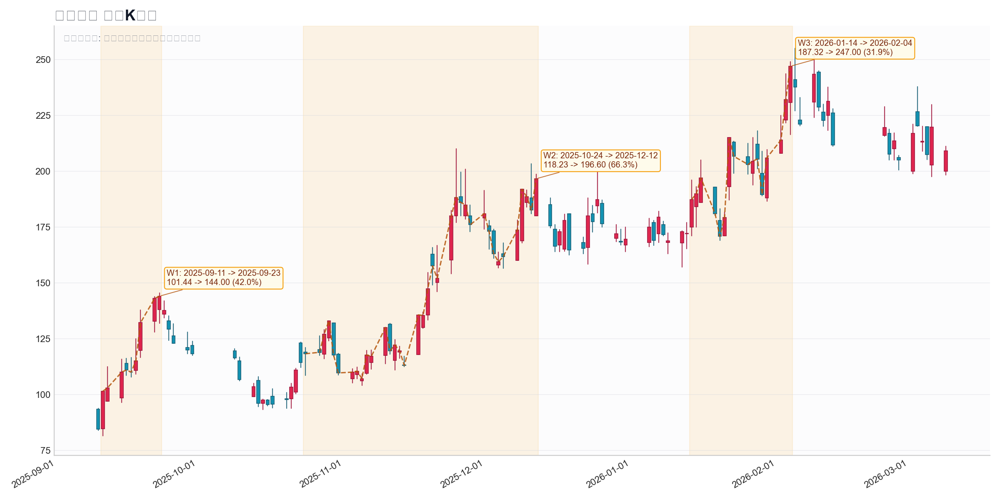

# 腾景科技波段归因

## 基础信息

- 标的名称：腾景科技
- 股票代码：`688195.SH`
- 分析窗口：`2025-09-10` 到 `2026-03-09`
- 样本来源：`data/top400_theme_concept_top15_random3.csv`
- 样本标签：`数据中心`
- Top400 rank：`103`
- Top400 原始区间涨幅：`134.42%`
- 正式任务交付日：`2026-03-27`
- 事实基线：`本报告主体沿用 2026-03-26 已完成的本地 PostgreSQL 正式归因结果；该次任务已使用 event_quant / event_news。`
- 当前执行复核：`2026-03-27 本轮复核时，当前会话无法重连 localhost:5432，且本机未检测到运行中的 PostgreSQL 服务；因此本次不重写数据库查询结果，只做正式交付收口与审计信息补齐。`
- 本报告量价主口径：`event_quant.raw_stock_daily_qfq`
- 一句话逻辑：`腾景科技这轮主升的真实驱动力不是泛数据中心，而是 AI 光通信主线下的 OCS / CPO / 硅光链重估，叠加 Google TPU 链映射和 1.6T 光模块需求上修。`

说明：

- `event_quant` 口径下，`2025-09-10` 到 `2026-03-09` 实际区间涨幅约为 `147.37%`，与 Top400 文件中的 `134.42%` 存在口径差异，本报告以本地 PostgreSQL 正式任务结果为准。
- `腾景科技` 在随机样本池里的入池标签是 `数据中心`，但本次归因重点是裁决它到底是“数据中心映射股”还是“光通信 / OCS / CPO / 硅光链”。

## 波段列表

- `W1`
  - 波段区间：`2025-09-11` 到 `2025-09-23`
  - 价格区间：`101.44 -> 144.00`
  - 波段涨幅：`41.96%`
  - bars：`9`
  - 是否进入归因分析：`no`
- `W2`
  - 波段区间：`2025-10-24` 到 `2025-12-12`
  - 价格区间：`118.23 -> 196.60`
  - 波段涨幅：`66.29%`
  - bars：`36`
  - 是否进入归因分析：`yes`
- `W3`
  - 波段区间：`2026-01-14` 到 `2026-02-04`
  - 价格区间：`187.32 -> 247.00`
  - 波段涨幅：`31.86%`
  - bars：`16`
  - 是否进入归因分析：`no`

波段图：



## W2 波段

- 波段区间：`2025-10-24` 到 `2025-12-12`
- 价格区间：`118.23 -> 196.60`
- 波段涨幅：`66.29%`
- 波段审查：
  - 规则切段结论：`主升段`
  - 人工作业结论：`up_valid`
  - 说明：`这段具备持续性趋势上行结构，10 月下旬起由光通信 / OCS 方向点火，11 月中旬出现涨停，12 月初到 12 月 10 日前后继续被光通信 / NPO / OCS 催化强化，符合典型主升段特征。`
- 是否进入归因分析：`yes`

### 归因结论

- 主因：
  `2025-10-24 到 2025-12-12｜AI 光通信 / OCS / CPO / 硅光链主升｜这一段最核心的催化，不是泛数据中心扩容，而是 1.6T/800G 需求上修、Google TPU 链强化、硅光 / CPO 趋势加速、OCS 起量预期升温，市场把腾景科技交易为 OCS 核心光学器件映射股。`
- 备选：
  `数据中心、光模块、Google TPU链、量子科技、福建区域属性都参与了交易，但更像并行强化项；其中“数据中心”是样本标签，不足以解释这段主升为何集中落在腾景科技这类 OCS / 光器件标的上。`
- 结论说明：
  `量价和 news 节奏都更支持“光通信 / OCS / CPO / 硅光链”而不是“数据中心”。本地 news 里从 10 月 24 日的“1.6T/800G大幅加单”、10 月 26 日的“光通信进入硅光时代”、10 月 27 日的 Google OCS 价值量测算、到 11 月 10 日 Google TPU 需求爆发和 11 月 11 日 OCS 开始起量，催化是连续且收敛的。数据中心概念在概念相关性里只排到第 `11`，明显弱于光纤概念和共封装光学(CPO)。`

### ChatGPT 联网归因

- 当前状态：
  `结果尚未写入。本次可审计任务记录显示，ChatGPT 自动化会话落到了 workspace/deactivated 页面；2026-03-27 复核时，Chrome CDP 也未能在当前会话内正常拉起。`
- task id：
  `df0c6eb3-c922-4a8d-a68c-f9fe5d377586`
- `.state` 路径：
  `skills/chatgpt-plus-browser/.state/df0c6eb3-c922-4a8d-a68c-f9fe5d377586.json`
- 当前 status：
  `url=https://chatgpt.com/workspace/deactivated, status=queued, watcherError=Cannot read properties of undefined (reading 'url')`
- 本次 prompt：
```text
请只分析 A 股个股波段归因，不要写过程话术。

标的：腾景科技（688195.SH）
波段：2025-10-24 到 2025-12-12
波段涨幅：66.29%
样本标签：数据中心

请联网后只输出以下结构：
主因：
备选：
搜索依据：
时间线：
结论说明：

要求：
1. 只讨论这个波段时间窗内能解释主升的催化。
2. 明确判断真实主线是否是光通信 / OCS / CPO / 硅光链，而不是数据中心。
3. 如果存在 光模块 / 1.6T / Google TPU链 / AEC / 量子科技 等交叉题材，放到备选，不要混成主因。
4. 输出要短、结论化、可直接粘到研究报告。
```

## 本地 news 库证据

| 序号 | 时间 | 来源 | 标题 | 链接 |
|---|---|---|---|---|
| 1 | 2025-10-24 01:33:41.626000+00:00 | `zsxq_damao` | 坚定看好光模块核心方向，#【1... | [link](https://api.zsxq.com/v2/topics/55188251822541454) |
| 2 | 2025-10-26 11:59:29.950000+00:00 | `zsxq_zhuwang` | 【华西电子】光通信进入硅光时代... | [link](https://api.zsxq.com/v2/topics/45811455814221288) |
| 3 | 2025-10-27 05:15:46.219000+00:00 | `zsxq_damao` | Google OCS交换机市场... | [link](https://api.zsxq.com/v2/topics/45811455225422548) |
| 4 | 2025-10-28 04:36:40.589000+00:00 | `zsxq_zhuwang` | 🔥🔥【民生电子】天弘科技：AS... | [link](https://api.zsxq.com/v2/topics/82811522112881212) |
| 5 | 2025-11-10 10:24:25.784000+00:00 | `zsxq_damao` | #1110算力最新重点事件： ... | [link](https://api.zsxq.com/v2/topics/22811515812258541) |
| 6 | 2025-11-11 01:50:46.905000+00:00 | `zsxq_zhuwang` | 【北美光模块】大涨，# 坚定看... | [link](https://api.zsxq.com/v2/topics/22811515224128511) |
| 7 | 2025-12-08 11:09:08.864000+00:00 | `zsxq_zhuwang` | 【ZX通信】Scale up带... | [link](https://api.zsxq.com/v2/topics/45811854852528248) |
| 8 | 2025-12-09 00:53:26.721000+00:00 | `zsxq_zhuwang` | [礼物]【全球InP衬底龙头】... | [link](https://api.zsxq.com/v2/topics/82811825258544142) |
| 9 | 2025-12-10 13:00:04.249000+00:00 | `zsxq_damao` | 🔶#光通信/NPO升级（算力基... | [link](https://api.zsxq.com/v2/topics/45811854112112118) |

### 证据原文

#### 证据 1
- 时间：`2025-10-24 01:33:41.626000+00:00`
- 来源：`zsxq_damao`
- 标题：坚定看好光模块核心方向，#【1...
- 链接：[link](https://api.zsxq.com/v2/topics/55188251822541454)
- 原文：
```text
坚定看好光模块核心方向，#【1.6T/800G大幅加单】，首推：#旭创/新易盛/源杰/腾景/汇绿等

①1.6T相对此前大幅上修；800G也有明显增加
②龙头公司加速扩产，产能26年相对25年大增
③CW光源紧缺，行业加速锁产能和供应商导入
④关注PD/隔离器/FAU等环节

重点推荐：
光模块：#中际旭创/新易盛/天孚通信/汇绿生态/东山精密/剑桥科技/华工科技/光迅科技/联特科技/德科立等
上游芯片：<e type="hashtag" hid="88258884881252" title="%23%E6%BA%90%E6%9D%B0%E7%A7%91%E6%8A%80%2F%E4%BB%95%E4%BD%B3%E5%85%89%E5%AD%90%2F%E9%95%BF%E5%85%89%E5%8D%8E%E8%8A%AF%E7%AD%89%23" />
OCS：#腾景科技/光库科技/光迅科技/凌云光/杰普特/中际旭创/德科立等。
光器件：#天孚通信/杰普特/仕佳光子/长芯博创/光库科技/东田微/太辰光等
```

#### 证据 2
- 时间：`2025-10-26 11:59:29.950000+00:00`
- 来源：`zsxq_zhuwang`
- 标题：【华西电子】光通信进入硅光时代...
- 链接：[link](https://api.zsxq.com/v2/topics/45811455814221288)
- 原文：
```text
【华西电子】光通信进入硅光时代，强烈看好与硅光方案深度绑定的核心产业链@所有人 

🌹随着光通信传输速率越来越高，低损耗、低功耗需求日益迫切，CPO共封装产业趋势加快，发展趋势由光模块CPO→OCS→CPO交换机→OIO。
1）光模块CPO：目前光模块CPO处于爆发式增长阶段，旭创引领行业发展。基于目前对于低功耗、低损耗迫切的需求叠加EML芯片缺货，硅光方案有望超预期放量，明年1.6T光模块开始爆发式增长；
2）OCS交换机：谷歌引领，已处于放量阶段；
3）交换机CPO：NV、博通引领，行业有望于26年开始批量，27年开始加速渗透；
4）柜内OIO：台积电引领，NV roadmap预计28年开始量产。

🧧产业链核心环节：
1）光模块CPO：中际旭创、新易盛、富士康、立讯精密、兆驰股份、剑桥科技等；
2）CW光源：源杰科技、仕佳光子；
3）硅透镜/一体化准直透镜/V groove：炬光科技；
4）FAU：天孚通信、炬光科技（高通道FAU）、致尚科技；
5）光引擎：天孚通信；
6）OCS：炬光科技（N*N准直器阵列+V groove）、腾景科技（液晶方案OCS的晶体光楔）、福晶科技（液晶方案OCS的晶体光楔）、光迅科技（OCS环形器）；
7）硅光耦合/贴片/测试设备：罗博特科。
```

#### 证据 3
- 时间：`2025-10-27 05:15:46.219000+00:00`
- 来源：`zsxq_damao`
- 标题：Google OCS交换机市场...
- 链接：[link](https://api.zsxq.com/v2/topics/45811455225422548)
- 原文：
```text
Google OCS交换机市场及A股上市公司价值量统计

一、市场增长预期
2025年：预计出货量1.2万台
2030年：预计出货量30万台
5年增长率：增长25倍

二、当前BOM成本
单台OCS交换机物料成本：5万美金   A股上市公司在BOM中的价值量（美元）统计如下：

1、光库科技：30,000 Google设计，代工由子公司武汉捷普生产

2、德科立：10,000 - 20,000 下一代320*320通道方案的光机模组送样中

3、赛微电子：6,000 MEMS振镜代工（每台交换机需2芯片，单价3,000美金）

4、腾景科技：5,000 含交换机内部器件（棱镜/滤光片等1,000美金）+ 定制光模块波分复用&环形光学器（4,000美金）

5、太辰光：1,000 FAU单机（供应康宁，间接供货Google）IN%

6、炬光科技：276 二维微透镜阵列（276通道×1美金）

三、特别关注国产替代整机

7、恒为科技：联合麻省理工、北京大学、Meta等国内外著名机构，2025年8月研发成功交换机系列整机产品，9月份推向市场，未来订单数量可观！
```

#### 证据 4
- 时间：`2025-10-28 04:36:40.589000+00:00`
- 来源：`zsxq_zhuwang`
- 标题：🔥🔥【民生电子】天弘科技：AS...
- 链接：[link](https://api.zsxq.com/v2/topics/82811522112881212)
- 原文：
```text
🔥🔥【民生电子】天弘科技：ASIC需求强劲，3Q25业绩超预期

[玫瑰]领导好，今日Celestica（天弘）披露业绩，公司3Q25业绩超预期，同时上修了2025年和2026年业绩指引，夜盘上涨9%+，我们解读如下：

<e type="hashtag" hid="28258848284251" title="%233Q25%E4%B8%9A%E7%BB%A9%E8%B6%85%E9%A2%84%E6%9C%9F%23" />
➠3Q25营收31.9亿美元，同比+28%，超指引上限；
➠non-GAAP利润率7.6%，同比+0.8pct；
➠non-GAAP EPS 1.58美元，同比+52%，超指引上限；
拆分来看：
1⃣CCS（连接与云解决方案）营收24.1亿美元，同比+43%，其中硬件平台解决方案营收14亿美元，同比+79%；
2⃣ATS（先进技术解决方案）营收7.8亿美元，同比-4%。

<e type="hashtag" hid="48548828582558" title="%23%E4%B8%8A%E4%BF%AE2025%E5%8F%8A2026%E4%B8%9A%E7%BB%A9%E5%B1%95%E6%9C%9B%23" />
➠4Q25：营收33.25-35.75亿美元，non-GAAP EPS 1.65-1.81美元；
➠2025：营收122亿美元（此前预期115.5亿美元），non-GAAP EPS 5.9美元（此前预期5.5美元）；
➠2026：营收160亿美元，同比+31%，non-GAAP EPS 8.2美元，同比+39%；
➠最大客户（谷歌）在AI数据中心领域需求强劲，该趋势将延续至2027年。

[太阳]天弘是ASIC服务器核心供应商，公司业绩超预期反映谷歌、meta等ASIC需求旺盛，关注#长芯博创、#腾景科技；
[礼物]据公司最新业绩指引，2026年天弘PE为40倍，全球AI服务器龙头<e type="hashtag" hid="88258848284222" title="%23%E5%B7%A5%E4%B8%9A%E5%AF%8C%E8%81%94%23" /> 性价比凸显。

风险提示：下游需求不及预期的风险，竞争格局变动的风险，AI产业进展不及预期的风险。
联系人：民生电子 方竞/宋晓东
```

#### 证据 5
- 时间：`2025-11-10 10:24:25.784000+00:00`
- 来源：`zsxq_damao`
- 标题：#1110算力最新重点事件： ...
- 链接：[link](https://api.zsxq.com/v2/topics/22811515812258541)
- 原文：
```text
<e type="hashtag" hid="48548218882248" title="%231110%E7%AE%97%E5%8A%9B%E6%9C%80%E6%96%B0%E9%87%8D%E7%82%B9%E4%BA%8B%E4%BB%B6%EF%BC%9A%23" />

剑桥科技电话会指引超预期；沃尔德的金刚石微钻逻辑被深圳PCB厂验证，短期资金偏好。

Go­o­g­le TPU 需求爆发，An­t­h­r­o­p­ic、Ap­p­le 等纷纷采购，AI 计算增量显著。

NV­I­D­IA上调收入目标至5000亿美元，EPS调至9.5美元。关注台积电Co­W­oS产能扩充。

中际旭创在1.6T光模块领先，硅光扩产加速，上调2026年业绩预期至300亿+。

源杰科技弹性强，绑定头部客户是正向逻辑。

Go­o­g­le链核心公司（腾景科技、光库科技）受益 TPU 爆发，估值高但趋势强。

AWS Tr­a­i­n­i­um2/3 扩产、AI 订单激增，预计 2026 年 AI 收入新增 60 亿美元，利好生益电子。

国产 AI 芯片（寒武纪等）看好，年底摩尔 IPO 将带来交易机会。
```

#### 证据 6
- 时间：`2025-11-11 01:50:46.905000+00:00`
- 来源：`zsxq_zhuwang`
- 标题：【北美光模块】大涨，# 坚定看...
- 链接：[link](https://api.zsxq.com/v2/topics/22811515224128511)
- 原文：
```text
【北美光模块】大涨，# 坚定看好光通信@1111

【Tower】（硅光PIC）+17%、【AXTI】（InP衬底）+10%、【LITE】（光芯片）+8%、【COHR】（光模块）+8%等。

❗️总结26-27年模块需求大增，物料持续紧缺：1️⃣硅光占比有望显著提升；2️⃣光芯片持续紧缺、CW/EML/衬底等环节供不应求；3️⃣OCS开始起量。
重点推荐①光模块# 【旭创新易盛天孚东山剑桥汇绿等】，②光芯片方向# 【源杰仕佳等】、关注# AXTI，③OCS# 【腾景科技/光库科技/光迅科技/凌云光/杰普特/德科立】等。

❗️个股关注：
# 天孚通信：1.6T模块；
# 仕佳光子：CW在JQ&COHR进展等

【国泰海通通信团队】
```

#### 证据 7
- 时间：`2025-12-08 11:09:08.864000+00:00`
- 来源：`zsxq_zhuwang`
- 标题：【ZX通信】Scale up带...
- 链接：[link](https://api.zsxq.com/v2/topics/45811854852528248)
- 原文：
```text
【ZX通信】Scale up带来光通信增量，关注CPO/NPO/OCS等环节

我们此前在电话会上多次强调，光向Scale up网络拓展是大趋势。同时我们认为初期在形态上可能是百花齐放——光模块/CPO/NPO/OCS/ALC均可能是潜在的可行方案，海外大厂已经频频表态：

1、Lumentum CEO在近期的大会上提到optical scale-up的需求正在越来越明晰；CPO目前表现超预期，在2026H2将出现阶跃（big step-up）；同时OCS也将于2026年快速起量，29年市场空间将远超第三方机构预测的20亿美金。

2、Marvell宣布以32.5亿美元收购Celestial AI，Celestial AI的技术基于光子中介层，marvell表示将该技术与UALink和 ESUN交换芯片具有协同效应（ESUN代表"面向纵向扩展网络的以太网"），这也说明Scale up可能是真正需要CPO的应用场景。此前Ciena在今年9月也收购了CPO初创公司 Nubis。

3、今年讯石光通信大会上，博通已经证明了其硅光CPO与VCSEL NPO在功耗上优于重定时铜互联方案，在Scale up域光互联上具备很大的应用潜力。

Scale up域对于光互联是非常大的蓝海，看好未来产业发展带来的新增量，我们推荐思路如下：

1、龙头厂商在CPC/OCS/CPO等环节布局领先，同时明显业绩确定性高，建议关注推荐中际旭创、新易盛、天孚通信、汇绿生态、剑桥科技；

2、CPO/NPO/OCS带来新的整机代工/光器件/光芯片新增量，建议关注太辰光、长芯博创、源杰科技、仕佳光子、腾景科技、光库科技、德科立
```

#### 证据 8
- 时间：`2025-12-09 00:53:26.721000+00:00`
- 来源：`zsxq_zhuwang`
- 标题：[礼物]【全球InP衬底龙头】...
- 链接：[link](https://api.zsxq.com/v2/topics/82811825258544142)
- 原文：
```text
[礼物]【全球InP衬底龙头】#AXTI大涨10%，坚定看好光通信@1209

❗️衬底环节： 下游客户预期30年行业需求相对26年增长20X。 #光模块紧缺->光芯片紧缺->InP衬底紧缺进一步传导。

❗️【需求爆发/CAPEX占比提升/格局好/新技术升级】等共振：
[太阳]光模块：中际旭创/新易盛/东山精密/天孚通信/剑桥科技/汇绿生态/华工科技/光迅科技/联特科技/德科立等
[太阳]光芯片：源杰科技/长光华芯/仕佳光子/永鼎股份等
[太阳]CPO：天孚通信/太辰光/致尚科技/光库科技等
[太阳]OCS：腾景科技/光库科技/光迅科技/凌云光/杰普特/中际旭创/德科立等。
[太阳]光器件：天孚通信/光库科技/长芯博创/杰普特/仕佳光子/东田微/太辰光等
[太阳]国产算力：锐捷网络/光迅科技/翱捷科技/华工科技/紫光股份/中兴通讯等等

[拥抱]【国泰海通通信团队】
```

#### 证据 9
- 时间：`2025-12-10 13:00:04.249000+00:00`
- 来源：`zsxq_damao`
- 标题：🔶#光通信/NPO升级（算力基...
- 链接：[link](https://api.zsxq.com/v2/topics/45811854112112118)
- 原文：
```text
🔶<e type="hashtag" hid="15452154115542" title="%23%E5%85%89%E9%80%9A%E4%BF%A1%2FNPO%E5%8D%87%E7%BA%A7%EF%BC%88%E7%AE%97%E5%8A%9B%E5%9F%BA%E7%A1%80%E8%AE%BE%E6%96%BD%EF%BC%89%23" />

•催化事件：美股光通信龙头持续大涨；磷化铟成为800G/1.6T光模块关键材料，AXT三个月涨10倍

❗️<e type="hashtag" hid="48584285228858" title="%23%E5%8F%97%E7%9B%8A%E6%96%B9%E5%90%91%EF%BC%9A%23" />

•光模块：中际旭创、新易盛、天孚通信（机构抱团标的）

•磷化铟：云南锗业（6英寸InP衬底国产化）、跃岭股份、凯德石英

•MPO：特发信息，长芯博创

•OCS：腾景科技、德科立、光库科技

•观点：1.6T光模块对磷化铟需求是800G的3倍，机构持续加仓确定性最强的光模块龙头
```

## 量价与概念验证

- 全窗口个股涨幅（event_quant 口径）：`147.37%`
- W2 量价特征：
  - 区间涨幅：`66.29%`
  - 平均换手率：`10.25%`
  - 最大换手率：`18.11%`
  - 平均净流入：`3855.96`
  - 涨停记录数：`1`
  - 涨停日期：`2025-11-17`
- top8 候选概念（全窗口）：

| 概念 | 代码 | 区间涨幅 | 收盘价相关系数 | 日收益率相关系数 |
|---|---|---:|---:|---:|
| 海峡两岸 | `885939.TI` | `27.13%` | `0.8841` | `0.2595` |
| 福建自贸区 | `885617.TI` | `22.04%` | `0.8730` | `0.2487` |
| 光纤概念 | `886084.TI` | `42.73%` | `0.8391` | `0.4655` |
| 共封装光学(CPO) | `886033.TI` | `43.60%` | `0.8343` | `0.5221` |
| 卫星导航 | `885574.TI` | `26.84%` | `0.7935` | `0.2486` |
| 光学元件 | `884096.TI` | `19.39%` | `0.7846` | `0.4885` |
| 量子科技 | `885730.TI` | `23.14%` | `0.7770` | `0.3128` |
| 独角兽概念 | `885787.TI` | `14.19%` | `0.7682` | `0.2414` |

补充观察：

- `数据中心` 概念在全窗口只排到第 `11`，区间涨幅 `19.99%`、收盘价相关系数 `0.7260`、日收益率相关系数 `0.3495`，明显弱于 `光纤概念` 和 `共封装光学(CPO)`。
- `海峡两岸 / 福建自贸区` 排位较高，更多反映公司区域属性带来的量化联动噪音，不足以解释这段波段里从 `1.6T / 硅光 / OCS / Google TPU链` 连续强化出来的主升节奏。

## 综合裁决

- 主因：
  `光通信 / OCS / CPO / 硅光链主升`
- 备选：
  `数据中心、光模块、Google TPU链、量子科技、福建区域属性`
- 最终判定：
  `腾景科技这轮主升不是泛数据中心主线，而是 AI 光通信大叙事下的 OCS / CPO / 硅光链映射股重估。`
- 结论说明：
  `10 月 24 日以后最密集、最连续的催化，都是围绕 1.6T/800G 加单、硅光方案提速、Google OCS 价值量、Google TPU 需求爆发、OCS 开始起量、Scale up 光互联等展开。腾景科技被反复点名为 OCS 方向核心标的，这比“数据中心”这个过于宽泛的标签更能解释股价主升。`
- 置信度：
  `中高`
